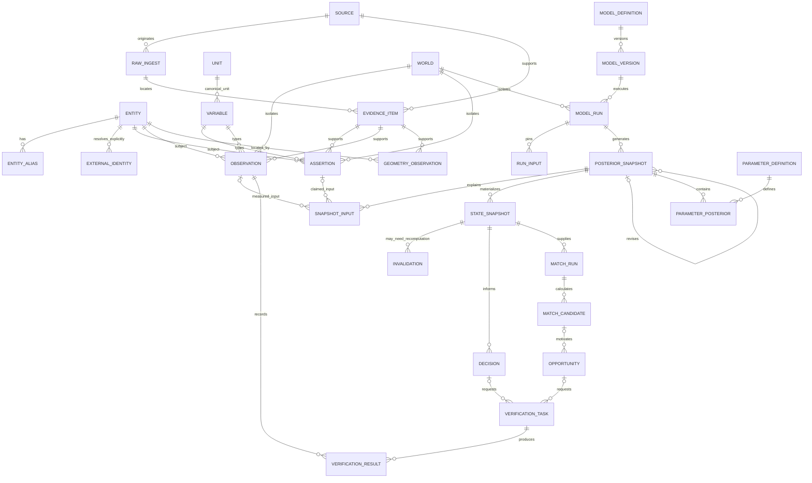
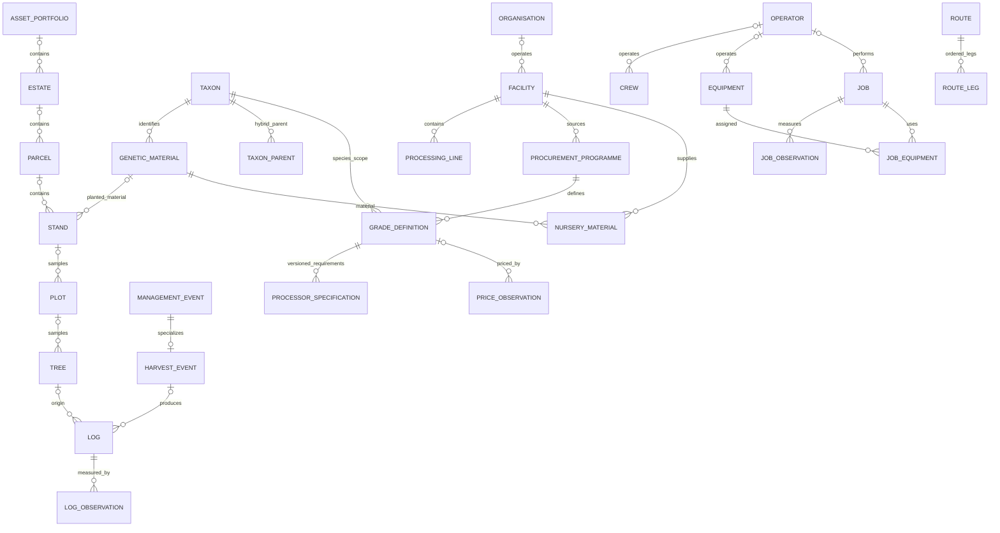

# Canonical State relationships

Key foreign-key paths are shown below. Each domain identity also references
`core.entity`. Optional hierarchy levels and optional source metadata are omitted
for readability; the executable schema is `backend/app/db/schema.py`.

