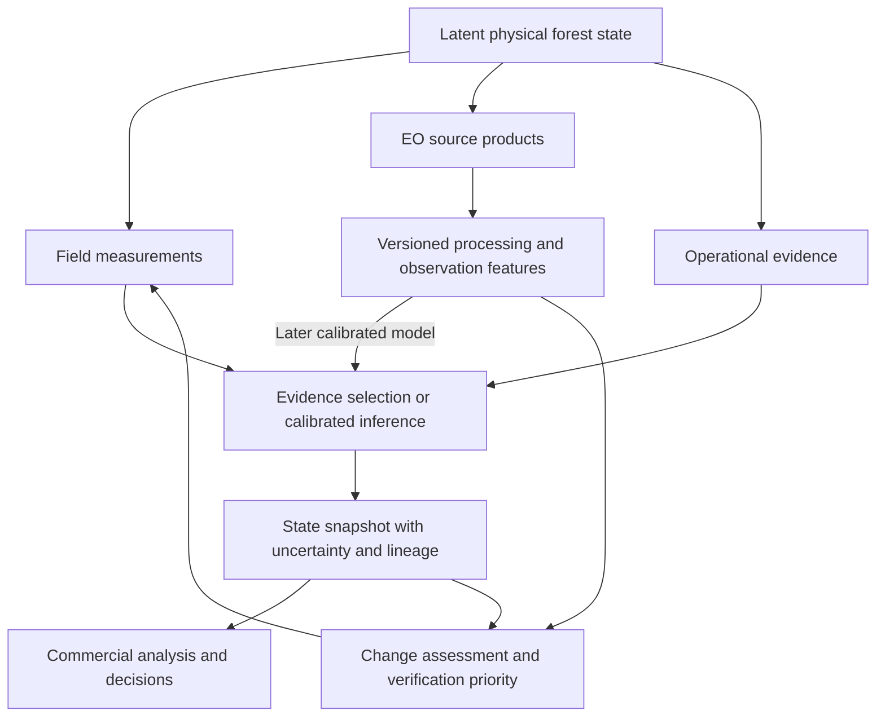

# EO observation architecture

Status: canonical design for the next EO implementation tasks; **not implemented**.
Audit date: 2026-09-06. Repository: `JasonOyugi/EA-Forests`, branch `main`,
HEAD `2d87e92244ca653335d5cd1dc9d0c87d71937199`. The initial architecture audit
started with a clean tree; the review revision started with the uncommitted state
recorded below. This revision changes this architecture document only.

This document extends [Canonical State v0.1](canonical-state-v0.1.md) and
[ADRs 0004](../adr/0004-canonical-postgresql-postgis.md),
[0005](../adr/0005-observation-assertion-inference-separation.md),
[0006](../adr/0006-immutable-canonical-evidence.md),
[0007](../adr/0007-bitemporal-canonical-history.md),
[0008](../adr/0008-derived-state-lineage-and-worlds.md), and
[0009](../adr/0009-canonical-relational-jsonb-boundary.md).
Existing executable contracts remain authoritative until additive migrations land.
The proposed tables, APIs, profiles, limits, and file names below are implementation
requirements or proposed defaults, not descriptions of working EO functionality.

Reading guide: sections 1-5 establish the audited foundation; 6-11 define spatial,
observation and temporal semantics; 12-18 define integration and operations;
19-24 define acceptance and unresolved inputs; section 25 is the next-PR sequence.

## 1. Executive architectural decision

**DECISION D1:** Extend the existing canonical evidence/state system with an EO
observation subsystem. Google Earth Engine (EE) is its first execution provider.
Persist source evidence, geometry versions, processed measurements, derived
features, and inference as distinct objects. Present them in the existing
forestry asset/stand experience. Use the existing PostgreSQL/PostGIS database and
artifact store, with a small database-backed worker. Do not build another app.

**WHY:** The repository already has most of the durable domain foundation. The
missing capability is repeatable, temporal EO evidence attached to real spatial
units, followed by an explicit route to field verification and calibrated inference.

**ALTERNATIVES CONSIDERED:** An EE-specific satellite viewer; extending only the
point classifier; a new geospatial database/application; direct index-to-volume
updates on stand records.

**WHY NOT THE ALTERNATIVES:** They respectively couple UI semantics to one vendor,
lose stand geometry/history, duplicate existing identity and evidence, or confuse
an observation with the physical state it only partially reveals.

**WHAT WOULD MAKE US REVISIT THE DECISION:** A demonstrated constraint in the
canonical platform that cannot be resolved additively. Provider cost or availability
can change the adapter without changing this domain decision.



MVP first delivers real field ingestion and explainable selected-state refresh,
then EO evidence history, quality, descriptive change and field verification
candidates. It does not deliver a calibrated forest-state posterior,
event classifier, or satellite-derived commercial inventory by assertion.

## 2. Current-state audit

### Evidence and scope of this audit

**Git reconciliation check before this revision:** local branch `main`, HEAD
`2d87e92244ca653335d5cd1dc9d0c87d71937199`; configured `origin` is
`https://github.com/JasonOyugi/EA-Forests`. A live `git ls-remote --heads origin`
returned only `main`, at `62f4f7b1a2cffb83f55f2f9c1e24e48ab851594f`, matching the
local tracking ref. Local `main` is **4 commits ahead, 0 behind** that remote tip.
The unpublished commits are `a13ec97`, `fe46104` (merge), `94a551f`, and `2d87e92`.
Canonical-state schema, migrations and architecture were introduced in
`94a551f808bb9698843c9439963849bb33fb8369`, which is not reachable from remote
`main`; those files are absent from that remote tree. The EO document is **untracked**:
there is no local EO architecture commit, and the file is absent from remote
`main`. This is a published-branch check, not a claim about inaccessible/dangling
server objects. The existing `README.md` modification is unrelated to this revision
and is left byte-for-byte unchanged. No commit, push, merge, or feature work was
performed. Sequence step 0 must reconcile and publish the reviewed baseline before
implementation starts; a later editor must repeat this check because refs can move.

The audit inspected backend services/schemas/migrations/tests, frontend routes,
asset and analytical components, map utilities, preprocessing scripts, package
contracts, and architecture/ADR documentation. Searches covered Earth Engine,
spatial/geospatial, GeoJSON/KML, polygons/AOIs, Leaflet, rasters/tiles, climate,
site classification, assets/forests/stands, observations, state, uncertainty,
provenance, caching, jobs, persistence, and API schemas. No project-owned
`AGENTS.md` was found in the repository or its ancestor instruction locations.

The requested `codex`, `fs-dev`, `maps`, `frontend-design`, `simplify-code`, and
`dogfood` skills and the `awwwards-web-director/references/ea-forests.md` baseline
were read. Their relevant guidance supports reuse, domain preservation, scoped
changes, and evidence-based validation. This is not a code cleanup or browser QA
assignment: no delegated coding, simplification, map geocoding, or UI edits were
performed. Frontend findings below are source-code findings, not a claim of visual
or interactive QA. Previous validation reports are historical evidence, not new
test runs in this pass.

The following runtime facts are supplied as verified project facts: project
`ee-oyugijason` is operational; a live authenticated EE request succeeded; the
repository auth helper reuses valid local credentials; the Vite-proxied
`GET /api/earth-engine/status` reports `authenticated=true`; FastAPI is local at
`127.0.0.1:8000`; Vite proxies `/api`. Production backend hosting is undecided.
Cloud Resource Manager/Service Usage administrative API enablement is unverified
and does not negate those runtime facts. This pass did not repeat OAuth or change
cloud settings.

### Audited implementation

Paths refer to the pinned HEAD above. Symbols identify the relevant code even
when later edits shift line numbers.

| Area and concrete evidence | What exists | Consequence for EO |
| --- | --- | --- |
| `backend/app/main.py`: `earth_engine_status`, `site_classification`; `backend/app/schemas.py`: `SiteClassificationRequest` | FastAPI, synchronous model calls, typed point/buffer inputs; EE dependency error maps to HTTP 424; other source errors can appear inside result payloads | Preserve legacy endpoint, payloads, and source selection; add EO routes separately |
| `backend/app/earth_engine.py`: project/network helpers; `backend/app/auth_earth_engine.py`: `main` | Project from `EARTH_ENGINE_PROJECT` or `GOOGLE_CLOUD_PROJECT`; local OAuth; explicit system-proxy opt-in | Reuse environment and network behavior; add unattended identity through configuration later |
| `backend/app/services/site_classification.py`: `ensure_earth_engine_initialized`, `verify_earth_engine_ready`, `safe_getinfo`, `site_geometry` | Cached initialization, live `ee.Number(1)` probe, EE point/buffer creation; runtime EE objects stay in service code | Extract shared EE runtime cautiously; current broad auth-error labeling must not define new provider error semantics |
| Same service: `extract_terraclimate_monthly`, `get_chirps_monthly`, `get_era5_land_monthly_ee`, `get_topography_metrics` | TerraClimate scaling, monthly CHIRPS sums, ERA5-Land aggregation, SRTM terrain; spatial means over buffers, usually `bestEffort=True` | Preserve source knowledge; add fixed-grid polygon profiles with explicit provenance instead of silently reusing best-effort resolution |
| Same service; `backend/scripts/generate_trial_site_climate_profiles.py` | NASA POWER and SoilGrids also exist; warnings/errors and pandas results; offline climate-profile script caches by site ID | These are real environmental integrations. The script cache is not an AOI/period/version-aware observation cache |
| `backend/app/db/schema.py`; `backend/app/db/session.py`; `backend/migrations/versions/0001_canonical_state.py`, `0002_source_and_permission_integrity.py`; `compose.canonical.yml` | SQLAlchemy Core, Alembic, PostgreSQL/PostGIS, lazy DB connection, 14 canonical namespaces | PostgreSQL/PostGIS is already chosen, not a new EO infrastructure recommendation |
| `backend/app/db/schema.py`: forestry tables and `geometry_observation` | Optional portfolio/estate/parcel/stand/plot/tree hierarchy; immutable temporal geometry evidence, source/world references, EPSG:4326 validity checks and GiST index | Extend these identities; existing points/centroids are not surveyed boundaries |
| `backend/app/services/ingestion/market_databases.py`: `MarketImporter.geometry` | Market/forest import identity, evidence, synthetic quarantine; imported coordinates become points; original polygon claim remains metadata | Do not reconstruct a boundary from area, centroid, species grouping, or a display offset |
| `backend/app/domain/values.py`, `units.py`; `services/state/facts.py` | Explicit variable/unit/missingness/epistemic classes; facts reject `DERIVED`, `INFERRED`, `FORECAST`; invalidation on new facts | Add dedicated feature outputs; do not squeeze derived EO vectors into the generic fact endpoint |
| `services/evidence/artifacts.py`: `ArtifactStore`, `LocalArtifactStore` | Private content-addressed bytes, atomic publication, hash verification, opaque `sha256:` URIs | Reuse for manifests, geometry uploads, code, and bounded exports; no public raw artifact server |
| `services/state/registry.py`, `snapshots.py`, `legacy_roundwood.py` | Code-version registration; world-safe lineage; evidence selection; snapshot explanation/rebuild; strict legacy roundwood adapter | Reuse model infrastructure. `selected_evidence_v0.1` is recency selection, explicitly not Bayesian updating |
| `snapshots.py`: `scope_entities`, `select_inputs`, `build_snapshot` | Facility/grade scope plus explicit entity; one selected value per subject/variable visible at an instant | Not a stand time-series assimilator; a new temporal inference consumer is required |
| `db/schema.py`: `verification_task`, `verification_result`, `management_event`, `decision` | Task/result and commercial/decision foundations; `/api/canonical/verification-tasks` can create/list tasks | Extend workflow and typed signal links, not another task store; verification result submission is not implemented by current routes |
| `api/canonical.py`: `require_access` | Local administrative Bearer token, disabled without configuration; source redaction; no production tenant authorization | Never put this administrative secret in a Vite bundle or use it as public user auth |
| `vite-version/src/config/routes.tsx`; `vite-version/vite.config.ts` | `/dashboard`, `/dashboard/assets-map`, `/assets/add`; combined `/models/site-species-analysis`; old classifier URLs redirect; dev and preview proxy `/api` | Embed EO in asset routes, preserve model redirects and proxy |
| `app/dashboard/data/forestry-data.ts`; `components/data-table.tsx`: `createPolygon`; `components/dashboard-grid.ts`: `seededUnit`, `buildSiteGrid` | In-memory seeded ledger, modeled financial/biological values, generated rectangular polygons and synthetic condition grid | Existing `group-*`/`sub-*` IDs and condition labels are demo inputs, not canonical EO targets |
| `app/dashboard/components/dashboard-asset-map.tsx`; `app/dashboard/assets-map/page.tsx` | Selected asset map, polygons, side panels, charts, market layers and route context | Reuse selection and panel patterns; do not feed EO into synthetic survival/volume calculations |
| `components/ui/map.tsx`; `components/sites-map.tsx`; `app/maps/basic-ssmt*.ts*` | Leaflet/react-leaflet, tile layers, polygon drawing primitives, map controls; preprocessed suitability GeoJSON chunks | Map and drawing primitives already exist. SSMT suitability polygons are context, not management boundaries or monitoring measurements |
| `app/shop/data/generated-boundaries.ts`, `generated-admin-boundaries.ts`; `vite-version/scripts/preprocess-basic-ssmt.mjs` | Generated boundary layers, KML-derived references, EPSG:4326 GeoJSON preprocessing | Existing geographic assets remain intact; no production AOI import/version workflow was found |
| `app/assets/add/page.tsx`; `components/coming-soon-preview.tsx`; `app/models/site-species-analysis/page.tsx` | Registration placeholder and preview wrappers around some analytical UI | Backend capability is not proof of completed end-user asset registration or field workflows |
| `packages/contracts/src/index.ts` | Cross-surface content/navigation references, not canonical EO contracts | Add a scoped EO contract surface later; do not mistake `canonicalId` in editorial links for an asset FK |
| `backend/tests/test_canonical_*.py`, `tests/conftest.py`, `app/check_backend.py` | Unit/API/integrity tests; real disposable PostGIS tests; live model smoke helper | Extend existing testing boundaries; skipped DB tests are not DB validation |

Other caches are process-local: currency TTL data, genetics catalogue loading,
database engines, and EE initialization. Searches found no production Sentinel-1/2
extraction, EO provider contract, durable EO request queue, raster export store,
EO tile endpoint, or stand EO assimilation workflow in application code. Existing
operational jobs and model-run statuses do not implement an execution queue.

## 3. Existing functionality to preserve and reuse

**DECISION D2:** Choose **B: site classification remains a sibling service using
shared EE infrastructure**. Share initialization, credential resolution, network
configuration, sanitized error classification, and dataset specifications first.
Move specific climate/terrain extraction into reusable provider functions only
after compatibility fixtures establish equivalent legacy output.

**WHY:** The classifier mixes environmental extraction, pandas aggregation,
site metrics, NASA POWER, SoilGrids, and UI-specific tables. Its valid point/buffer
use case should not require a canonical asset, PostgreSQL, or a long-running job.

**ALTERNATIVES CONSIDERED:** A: immediately convert the entire classifier to a new
provider interface; C: move all classification into the observation subsystem.

**WHY NOT THE ALTERNATIVES:** A is a larger regression surface before the EO
contract exists. C conflates descriptive environmental evidence with site/species
analytical outputs and changes existing execution/persistence behavior.

**WHAT WOULD MAKE US REVISIT THE DECISION:** Both services need the same tested
extraction operation. That operation can then sit behind a shared environmental
provider interface (incremental A); classification stays a consumer. An explicit
persist-classifier-evidence action may later write observations without making
every exploratory point click a permanent observation.

Preserve source names, year handling, point/buffer zero-radius behavior, existing
source-error results, HTTP contracts, model calculations, trial-site adapters,
market JSON, generated GeoJSON, auth helper behavior, and database-independent
legacy startup. Do not refactor unrelated commercial or genetics services.

## 4. EO gaps

Required additions are: real asset-to-AOI binding; immutable polygon selection
and import provenance; provider-neutral source/processing contracts; sensor-specific
quality and feature registries; durable temporal records; explicit feature lineage;
bounded asynchronous execution; real asset read models; raster presentation
descriptors; field-verification signal links; and scientific acceptance fixtures.

In particular, neither a green map cell nor a successful EE status probe proves
that an asset has a valid boundary, usable optical coverage, known stocking,
calibrated uncertainty, or a production identity. Existing posterior tables provide
storage and lineage, not a trained observation model.

## 5. Domain boundaries and scientific semantics

Conceptually, `X_t` is physical state, `U_t` describes management/actions, and `Z_t`
contains environment and acquisition conditions:

```text
X_t ~ p(X_t | X_(t-1), U_t, Z_t, transition_parameters)
Y_(s,t) ~ p(Y_(s,t) | X_t, Z_t, sensor_protocol, observation_parameters)
belief_t = p(X_t, parameters | evidence available by knowledge cutoff)
decision = argmax_a E[utility(a, X_t) | belief_t], subject to constraints
```

These equations specify boundaries, not an implemented probability model. Correlated
features from one image are not independent evidence. Source measurement error,
spatial variability, model discrepancy, parameter uncertainty, and state uncertainty
must remain separately named. Missingness can depend on clouds, season, and state;
it is not generally random.

| Layer | Examples | Owner / persistence | Prohibited shortcut |
| --- | --- | --- | --- |
| A. Physical latent state | DBH distribution, height, stems/ha, wood properties | Domain variables; represented by beliefs, never overwritten as mutable truth on identity | Calling a vegetation index tree inventory |
| B. Source observations | Sentinel L2A reflectance or calibrated GRD products; field measurements; operational records | Source/evidence items and observation records with processing level | Calling L2A/GRD unprocessed instrument data; treating reanalysis as a field measurement |
| C. Derived observation features | NDVI distribution, VV/VH transform, trajectory summaries | Typed EO feature sets, versioned processing runs, `DERIVED` | Storing arbitrary features as unqualified `OBSERVED` forestry variables |
| D. Inferred/modelled state | Calibrated stocking or growth-state distribution; selected evidence | Existing model runs and belief/state snapshots with distinct `state_type` | Calling deterministic selection a posterior update |
| E. Decision outputs | Verification plan, harvest scenario, supply/processor match | Verification/commercial/decision domains, pinned state/evidence | Pricing an index or equating a change alert to harvested tonnes |

Environmental context needs an additional origin descriptor:
`measurement | retrieval | reanalysis | interpolated | modelled | reported`.
It describes the source product, separately from EA Forests' epistemic class.
TerraClimate water-balance outputs and ERA5-Land are not direct in-stand readings.
Preserve their provider-model nature when displaying or assimilating them.

## 6. Canonical spatial/AOI model

**DECISION D3:** Use the existing optional hierarchy:

```text
forestry.asset_portfolio -> forestry.estate -> forestry.parcel -> forestry.stand
                                                              -> forestry.plot -> forestry.tree
```

The current schema also allows a stand to reference an estate directly and a tree
to reference a stand directly. Do not fabricate missing parents. "Forest/property"
normally names an estate or parcel; "compartment" may be a stand label. A distinct
management-unit level requires a real operational need and a later domain decision.

Add `geo.aoi` as a stable analysis identity and `geo.aoi_version` as its immutable
boundary selection. An AOI belongs to one `world_id`; its optional
`subject_entity_id` binds an existing canonical asset/stand/plot. Unbound AOIs use
an explicit `core.entity` of type `analysis_area` as their geometry owner without
inventing a forest. Binding to an asset later is a reviewed new AOI identity/link,
not a silent change to historical subjects.

**WHY:** Analysis area and asset ownership/identity are related but different.
An AOI can represent an uploaded study area, an asset boundary, or a buffer without
asserting that all three are surveyed management units.

**ALTERNATIVES CONSIDERED:** Use mutable GeoJSON on the stand; use only a geometry
hash; create parallel forest/compartment tables; use the latest geometry view.

**WHY NOT THE ALTERNATIVES:** They lose revisions, confuse identity with equality,
duplicate the forestry model, or change historical computations when a boundary
is corrected.

**WHAT WOULD MAKE US REVISIT THE DECISION:** A platform-wide spatial-unit abstraction
replaces the AOI projection while preserving its immutable references and semantics.

### Identity, geometry, and revision contract

| Record | Required content and invariant |
| --- | --- |
| `geo.aoi` | UUID4 `id`, `world_id`, immutable geometry-owner entity, optional immutable asset subject, name and lifecycle policy; display name is not identity |
| `geo.aoi_version` | UUID4 `id`, AOI FK, monotonic revision unique within AOI, exact `geometry_observation_id`, normalized geometry hash, normalization version, area m2, bounds, provenance, creation time, valid/knowledge intervals, optional predecessor and correction reason |
| Existing `geo.geometry_observation` | Authoritative EPSG:4326 geometry, original SRID, method, precision, observed time, source/evidence/world; one row denotes one immutable geometry version |
| Processing spatial support | Grid CRS, affine transform/origin, pixel size, edge interpretation, reducer weighting and any erosion/intersection mask; derived support is not a replacement boundary |

Composite FKs or equivalent database guards enforce AOI/version/geometry/subject/
world agreement. Old observations always reference the old version. The default
current geometry view is only a discovery aid: user selection resolves to an exact
row before submission. Two equal geometries from independent sources can have
different versions and provenance. Hash equivalence does not merge assets.

Boundary correction and actual boundary change differ. Corrections append a
replacement with a new knowledge interval; a real subdivision has an effective
date and new child identities. Cross-version charts break the series unless the
user explicitly requests reprocessing to a fixed reference geometry. That
reprocessing produces new outputs labeled with the chosen support. Never stitch
different footprints into an apparently homogeneous trajectory.

### Accepted origins and validation

All input paths converge on the same validation/version service: existing canonical
polygon; GeoJSON upload; KML upload; drawing using existing Leaflet primitives; or
programmatic geometry. MVP first supports canonical polygon binding and GeoJSON;
drawing can follow using the same contract. KML is a bounded follow-on importer,
not a separate geospatial application. Original upload bytes are preserved with
parser version and hash before normalized output is accepted.

Use RFC 7946 longitude/latitude coordinates for GeoJSON interchange, including
Polygon and MultiPolygon holes. The application's explicit normalization records
ring ordering and edge semantics; the original bytes remain recoverable.
[GeoJSON specification](https://datatracker.ietf.org/doc/html/rfc7946).

Validation must reject nonfinite/out-of-range coordinates, empty/zero-area rings,
self-intersections, holes outside shells, malformed closure, and non-polygon EO
support. Check multipolygon overlaps, narrow slivers, geometry size and vertex
limits. Do not silently `make_valid`, convex-hull, simplify, drop holes, or union
unrelated features. A repair is a previewable new geometry with a reason and area
delta. FeatureCollections require selecting/assigning features; a union is explicit.
Calculate area in a suitable metric/geodesic method, never square degrees.

For initial East African AOIs, reject antimeridian-crossing or polar geometries
with a specific unsupported-domain reason; later support must explicitly split
and test them. AOIs spanning UTM zones need an explicit common analysis grid;
do not choose a zone per scene. Enforce the same recorded edge/densification
semantics in PostGIS and EE. Simplified display geometry is a separate read model.

KML later accepts Polygon/MultiGeometry content with bounded XML parsing, no
external entities or NetworkLinks, and explicit altitude handling. Keep CRS
transformation provenance for any supported non-GeoJSON input. KML origin alone
does not justify `official_kml`; use `digitised` unless source authority is known.

Point/buffer classification remains unchanged. To request EO from a point, the
user/program must specify a radius in metres. Persist the resulting polygon and
its generator version, point, radius, geodesic/planar method, and tolerance. Add
`generated` to the geometry method registry in a migration; do not call the
buffer surveyed. A zero-radius point cannot claim polygon coverage. A plot
smaller than a useful sensor footprint remains small; do not enlarge it silently.

## 7. Canonical observation model

**DECISION D4:** Separate source items, EO observation envelopes, derived feature
sets, and state inference. An API may compose these into one typed response; that
does not make them one database record. Reuse evidence and observation contracts;
use separate processing lineage for EO derivations under D16. Existing model and
state tables retain their named statistical/state/inference purposes.

**WHY:** Source products can be reused for different geometries and algorithms;
features can be recomputed without changing source evidence; inference can be
recalibrated without changing features. Each transformation needs its own identity.

**ALTERNATIVES CONSIDERED:** A single JSON observation row; one generic fact per
entire vector; relabel every derived index `OBSERVED`; create a posterior for every
image-processing operation.

**WHY NOT THE ALTERNATIVES:** These obscure queryable invariants, evade the current
fact constraints, confuse processing with sensing, or assert a belief update where
there is only a deterministic transformation.

**WHAT WOULD MAKE US REVISIT THE DECISION:** A general typed derived-evidence system
is adopted across providers. EO records may specialize it, retaining the same
lineage, immutability, and read contract.

### Proposed aggregate read contract: `EOObservationV1`

Strict request/response schemas reject unknown fields. Nullable scientific values
require explicit reasons. `observation_id` below is the EO envelope UUID, not an
alias for a scalar `observations.observation.id`; scalar links are named
`measurement_observation_id` to avoid ambiguity.

| Group | Fields and semantics |
| --- | --- |
| Identity | `schema_version="1"`, `observation_id`, `world_id`, `subject_entity_id` (nullable only for unbound AOI), `aoi_id`, `aoi_version_id`, `geometry_observation_id`, `geometry_hash`, `series_id`; asset ancestors returned as a typed read projection, not independent contradictory FKs |
| Source stream | `provider_key`, `sensor`, `platforms[]`, `collection_key`, `product_level`, `source_origin`, `stream_key`; sensor stream qualifiers are typed optical/SAR/context variants |
| Source items | `source_manifest_id/hash`, paginated `source_items`; each has canonical UUID, exact provider item ID, upstream product ID when available, item revision/processing baseline, sensing start/end, generation/retrieval time, footprint, native band metadata, source/evidence IDs, role and inclusion/exclusion reason |
| Time | `support_kind` (`acquisition` or `composite`), requested `[window_start,window_end)`, actual acquisition bounds or precise instant, source observation count, `processed_at`, database `recorded_at`; explicit `provisional` flag; no fabricated single sensing date for a composite |
| Processing | `processing_run_id`, `processing_version_id` (section 12, D16), code hash, git SHA when available, environment/lock hash, `recipe_key/version`, immutable config hash; composite method/order, mask recipe IDs and parameters, spatial reducer and weighting, statistics profile, target CRS/grid transform/scale, actual scale, native resolution per band, resampling rules, deterministic ordering |
| Quality | Typed coverage metrics, sample counts, `requested_qa_profile`, `applied_qa_profile`, `qa_profile_version`, QA availability and missing components, explicit fallback origin, quality flags and review status; all fractions have a declared denominator as below |
| Features | `feature_set_id` and version, `epistemic_class=DERIVED`, ordered typed `features[]`; separate feature processing run when reprocessed; referenced source envelope and exact support |
| Lineage | Source/evidence hashes, recipe/code/processing versions, geometry version, input feature IDs for change products; model version only for an actual model consumer; `reproducibility_level` (`reference_replay` or `frozen_inputs`) and optional immutable raster/QA artifact references |
| Outcome | `status` (`success`, `partial`, `no_observation`, `failed`), `reason_codes[]`, safe human-readable explanation, typed per-feature/per-stream availability; execution job state is separate |

Exact source-item identifiers are persisted relationally, not just a collection
name or a query URL. An auxiliary cloud-probability image is also a source item.
Keep excluded candidate IDs and rejection reasons in the hashed discovery manifest;
the used input links are mandatory relational records. No credentials, signed URL
tokens, or serialized EE object graphs are scientific provenance fields.

### Quality denominators

For the recorded analysis grid, let `A` be the full AOI area; `S` the footprint
area with valid required source bands before weather/quality masks; `C` the area
passing optical cloud/shadow/snow screening within `S`; and `V_f` the area valid
for feature `f` after all its masks and numerical checks. Areas use explicit
fractional cell overlap weights at the AOI boundary.

| Metric | Definition |
| --- | --- |
| `source_coverage_fraction` | `area(S)/A`; null with reason if source search failed, zero after a successful empty search |
| `clear_pixel_fraction` | `area(C)/area(S)` for optical data under the named applied QA profile; mask-estimated clear area, not verified truth or equivalent across profiles; null if `S` is empty or for SAR/context, with `NOT_APPLICABLE` distinguished from unknown |
| `usable_observation_fraction` | `area(V_common)/A` for the profile's required features on common support; if bands cannot share a grid, report per-feature values and null aggregate with reason |
| `feature_usable_fraction` | `area(V_f)/A`; never a fraction of only the remaining clear pixels |
| `valid_pixel_count` | Integer number of intersecting target cells with valid feature values; not independent sample size |
| `effective_area_m2`, `total_pixel_count` | Area-weighted valid support and intersecting AOI cell count; preserve alongside count |
| Composite support | Union of valid cells plus per-cell contributing acquisition count summaries; per-acquisition coverage remains queryable |
| Cloud metadata | Scene cloud percentage and AOI-specific cloud fraction have different fields; cloud probability is a masking diagnostic, not confidence in forest state |

For temporal comparisons use the common valid spatial support of both periods,
retain each original footprint, and report the overlap fraction. Cloudy area is
not evidence of canopy absence. Composite union coverage can be high even if no
single acquisition saw the entire AOI; expose that distinction.

### Feature value schema

Each feature definition has stable `key`, version, description, formula/band mapping,
canonical unit, expected domain, spatial/temporal support, and semantic class.
Each feature value refers to that definition and contains:

```text
feature_definition_id, feature_key, feature_version
value: finite decimal/number | null
value_statistic: mean | median | change | slope | anomaly
unit: registered symbol
spatial: {mean, variance, standard_deviation, median, min, max,
          quantiles: [{probability, value}], valid_pixel_count,
          total_pixel_count, effective_area_m2, source_coverage_fraction,
          usable_fraction, acquisition_count, eligible_acquisition_count}
statistics_profile, unavailable_statistics: [{statistic, reason_code}]
temporal: null | {baseline_id, comparison_feature_set_ids,
                 comparison_start, comparison_end, delta, slope_per_day,
                 anomaly, anomaly_method, common_support_fraction}
missingness: null | canonical missingness enum
reason_codes: registered codes[]
quality_flags: registered flags[]
```

`value` is the named primary statistic, not an unexplained duplicate. The required
first-pass `moments-v1` statistics profile includes area-weighted mean, population
variance/SD, source and usable coverage, valid area, valid/total target-cell counts,
and distinct acquisition/eligible-acquisition counts. Variance has squared feature
units; SD has feature units. For a single valid cell, spatial SD is zero but carries
a low-support flag; for none, value statistics are null and valid counts/area are
zero after a completed evaluation. Spatial SD describes heterogeneity, not state
uncertainty or standard error of the mean.

Weighted median and p10/p90 remain in the stable contract as an optional
`distribution-v1` scientific increment. Schedule them after the first Sentinel
extraction unless they can be implemented and independently validated without
material additional complexity. An uncomputed optional statistic is null/absent
with `STATISTIC_NOT_IMPLEMENTED` or `STATISTIC_NOT_REQUESTED`, never a zero or an
unweighted substitute; it does not make a complete `moments-v1` result partial.
Min/max remain optional diagnostics. Statistics-profile identity belongs in
processing provenance and cache keys; consumers declare which summaries they need.

Define spatial statistics over weights `w_i = area(AOI intersect cell_i)` for valid
cells: mean `sum(w_i*x_i)/sum(w_i)` and population variance
`sum(w_i*(x_i-mean)^2)/sum(w_i)`. The weighted quantile is the smallest sorted
value whose cumulative area weight reaches the requested fraction. An adapter
must prove this convention, or declare a different versioned approximation and
error bound; a stock percentile reducer must not silently substitute its default
histogram/unweighted behavior. EE percentile reductions can use histograms for
larger input sets. [EE percentile contract](https://developers.google.com/earth-engine/apidocs/ee-reducer-percentile).

Proposed pilot eligibility policy: a composite needs at least two distinct
acquisitions contributing per eligible cell; core-feature usable area at least
80% of AOI and at least 25 valid target cells for a comparison candidate. Smaller
or less-covered measurements can be retained and shown as partial/exploratory,
but cannot trigger automatic stand-change priority. Single-acquisition products
declare their own policy and do not claim the composite requirement was met.
Common-support comparisons also require 80% AOI overlap and compatible source
streams. These versioned thresholds are conservative pilot gates to validate,
not universal detectability or accuracy limits. Optional exploratory NDRE does
not make an otherwise complete core optical result partial.

Add a dimensionless ratio unit, a backscatter dB unit with reference definition,
and required climate/rate/angular units through the current registry. Ratios,
fractions, percentages, logarithms, Kelvin/Celsius, and calendar durations must
not share a misleading linear conversion rule. In particular, the existing
`convert` supports multiplicative conversions; dB-to-power and temperature offsets
belong in named processing functions. No volume/mass/currency conversion is added.

### Outcomes and missingness

| Outcome | Meaning and representative reason codes |
| --- | --- |
| `success` | All required profile outputs satisfy that profile's eligibility policy; optional unavailable features remain explicit |
| `partial` | At least one usable result and at least one required gap/quality shortfall: `PARTIAL_COVERAGE`, `INSUFFICIENT_VALID_AREA`, `POLARIZATION_UNAVAILABLE`, `AUXILIARY_QA_MISSING`, or a failed child stream |
| `no_observation` | Provider discovery/evaluation completed, but no usable evidence: `NO_ACQUISITIONS`, `ALL_MASKED`, `NO_COMMON_SUPPORT`, `INSUFFICIENT_SUPPORT`, `SOURCE_PERIOD_UNAVAILABLE` |
| `failed` | Could not establish a scientific outcome: `PROVIDER_AUTH`, `PROVIDER_PERMISSION`, `PROVIDER_QUOTA`, `PROVIDER_UNAVAILABLE`, `PROVIDER_TIMEOUT`, `PROCESSING_ERROR`, `PROVENANCE_INCOMPLETE` |

Generic canonical missingness remains `NOT_MEASURED`, `NOT_APPLICABLE`, `UNKNOWN`,
etc.; detailed EO causes live in the typed reason-code registry. A missing baseline
uses `BASELINE_INSUFFICIENT`, not zero anomaly. Provider failure does not produce
an empty successful series. A multi-stream request can be partial with valid SAR
and no optical observation; preserve both child outcomes. `success` means the
processing contract was satisfied, not that the forest is healthy or verified.

## 8. Provider abstraction

**DECISION D5:** Define a domain-level processing specification and provider
capabilities; adapters implement those specifications using their native execution
environment. The feature registry owns formulas and semantics. The adapter owns
the EE expression implementation, not the scientific definition.

**WHY:** Pushing large images into Python to obtain provider neutrality is costly.
A capability contract can keep execution near imagery while preserving meaning.

**ALTERNATIVES CONSIDERED:** Pass EE Images/Collections through services; download
all rasters for NumPy; promise every provider implements every feature identically.

**WHY NOT THE ALTERNATIVES:** Vendor types leak, transfer/storage costs grow, or
preprocessing differences are concealed. Matching names do not guarantee matching
measurements between providers.

**WHAT WOULD MAKE US REVISIT THE DECISION:** A second provider demonstrates a need
for a richer operation or local COG processing. Add a capability/recipe version
without changing the asset/evidence vocabulary.

Proposed Python protocol, expressed here as a design sketch only:

```text
EOProvider.capabilities() -> ProviderCapabilities
EOProvider.discover(SourceQuery, ExactGeometry) -> DiscoveryManifest
EOProvider.extract(ProcessingSpec, PinnedSourceItems, ExactGeometry) -> ExtractionResult
EOProvider.create_layer(LayerSpec, PinnedSourceItems, ExactGeometry) -> LayerHandle
EOProvider.poll/cancel(ProviderTaskHandle) -> ProviderTaskStatus  [optional capability]
```

`ExactGeometry`, source items, recipes, results, errors, and task handles are typed
domain DTOs containing ordinary values. An opaque provider handle cannot escape
the adapter into inference. Discovery and extraction operate on registered,
allowlisted collections/recipes, not arbitrary user EE expressions or URLs.

Capabilities declare sensors, temporal availability, supported reducers, CRS/grid
control, masks, batch execution, tiles, and export behavior. Unsupported operations
fail explicitly. Future STAC, Copernicus Data Space, commercial, drone, and uploaded
raster adapters may execute locally or remotely. They must disclose source levels,
band response differences, calibration, licensing, and equivalent-recipe tests.
Uploaded/drone imagery also needs acquisition/orthorectification/georeferencing
and radiometric-calibration evidence; a filename is not enough.

STAC is a source discovery/asset description standard, not EA Forests' posterior,
job, or observation database. Store stable collection/item/asset references and
checksums when supplied; do not require a STAC server to use EE.
[STAC specification overview](https://stacspec.org/en/about/stac-spec/).

## 9. Earth Engine adapter responsibilities

The EE adapter resolves explicit credentials/project, converts validated geometry
with recorded edge semantics, filters collections, captures source IDs, checks
required bands/QA, builds deterministic expressions, executes bounded reductions,
normalizes units and quality, sanitizes provider errors, and creates map handles.
Only this adapter/shared EE runtime imports `ee`. No EE API objects enter canonical
Pydantic models, SQLAlchemy rows, frontend contracts, or state inference.

Preserve initialization caching without assuming it proves access to every
collection. Keep EE runtime readiness separate from datastore readiness,
administrative API availability, and individual extraction success. A transport,
quota, or permission failure must not automatically trigger a browser OAuth flow.

Pin these initial source collections:

| Source | Product boundary and processing requirement |
| --- | --- |
| `COPERNICUS/S2_SR_HARMONIZED` | Surface reflectance Level-2A. Scale spectral DN by 0.0001; retain processing baseline/platform. Visible/B8 bands have 10 m sampling; red-edge/B8A/SWIR use 20 m. Early collection coverage is incomplete and QA60 has historical changes; do not use one QA60-only policy for the whole archive. [EE S2 catalogue](https://developers.google.com/earth-engine/datasets/catalog/COPERNICUS_S2_SR_HARMONIZED) |
| `COPERNICUS/S2_CLOUD_PROBABILITY` | Auxiliary cloud likelihood required by the enhanced QA profile only; SCL-core evidence does not require it. Join exact item identifiers and record missing joins/profile outcomes. Bright surfaces can have high probability; it is not ground truth. [EE cloud probability catalogue](https://developers.google.com/earth-engine/datasets/catalog/COPERNICUS_S2_CLOUD_PROBABILITY) |
| `COPERNICUS/S1_GRD` | Calibrated C-band backscatter in dB. Filter compatible instrument mode, polarization, orbit direction/relative orbit, and sampling before comparing observations. Keep provider processing metadata. [EE S1 catalogue](https://developers.google.com/earth-engine/datasets/catalog/COPERNICUS_S1_GRD) |
| `USGS/SRTMGL1_003` | Approximately 30 m terrain context from the historical SRTM mission; not current canopy height or a repeating forest-growth measurement. [SRTM catalogue](https://developers.google.com/earth-engine/datasets/catalog/USGS_SRTMGL1_003) |
| `IDAHO_EPSCOR/TERRACLIMATE` | Monthly climate/interpolated and modelled water balance at about 4.6 km. Preserve per-band scaling and source status. Do not infer within-stand drought variation from a coarse cell. [TerraClimate catalogue](https://developers.google.com/earth-engine/datasets/catalog/IDAHO_EPSCOR_TERRACLIMATE) |
| `UCSB-CHG/CHIRPS/DAILY` | Daily precipitation, 0.05 degree; aggregate complete day sets to monthly totals with missing-day counts. Keep source version, aggregation, and support. [CHIRPS catalogue](https://developers.google.com/earth-engine/datasets/catalog/UCSB-CHG_CHIRPS_DAILY) |
| `ECMWF/ERA5_LAND/MONTHLY_AGGR` | Reanalysis on roughly 11 km catalogue grid; preserve monthly sum versus mean semantics, temperature offsets, flux units, and catalogue caveats. Do not upsample it into apparent 20 m evidence. [ERA5-Land catalogue](https://developers.google.com/earth-engine/datasets/catalog/ECMWF_ERA5_LAND_MONTHLY_AGGR) |

The catalogues' latest dates are dynamic. Discover availability at execution and
record the result. A user request ending this month does not mean TerraClimate or
another context source has data through this month. NASA POWER and SoilGrids
remain supported by site classification; EO does not displace them.

## 10. Processing pipeline and feature decisions

**DECISION D6:** Start with explicit sensor-specific recipes, a small feature set,
per-acquisition records, and calendar-month composites. Default optical analysis
uses a fixed 20 m AOI grid; preserve each source band's native sampling. SAR uses
its own homogeneous stream and recorded grid. Context stays on its native support.
Version QA separately and select the operational default through validation.
First-pass spatial outputs are weighted means, variance/SD, coverage, valid area/
cells and acquisition counts; weighted spatial quantiles are an optional increment.

**WHY:** One optical grid makes masks and cross-band summaries auditable without
claiming SWIR/red-edge detail at 10 m. Separate SAR streams prevent acquisition
geometry changes from masquerading as forestry change.

**ALTERNATIVES CONSIDERED:** Compute every popular index; resample every source to
10 m; use latest-pixel or maximum-NDVI composites; automatically blend optical/SAR.

**WHY NOT THE ALTERNATIVES:** Redundant outputs encourage selective interpretation;
upsampling invents apparent precision; maximum selection biases greenness;
cross-sensor blending needs an observation model.

**WHAT WOULD MAKE US REVISIT THE DECISION:** Held-out field evidence shows an
additional feature or grid materially improves stability or decision value. A
10 m optical-only recipe can coexist with a distinct series/version.

### Pipeline

1. Validate access, world, AOI version, period, recipe, geometry and work limits.
2. Resolve/create the durable deduplicated job; load the exact geometry and recipe.
3. Discover source items; archive the discovery manifest and all used item/QA
   identifiers. Group granules/slices belonging to one acquisition; overlapping
   granules do not count as independent observations. Fix deterministic overlap
   priority using QA, acquisition metadata, then item ID.
4. Create a `processing.run` with pinned geometry and relational source inputs.
   Record exclusions, versions, unit transforms, grid and masks before completion.
5. Apply source-specific scaling/quality rules. Compute features per valid pixel
   and per acquisition. Record raw-product metadata and optional band-summary
   measurements separately from derived indices.
6. Aggregate per pixel through the declared temporal window, then reduce spatially
   over the AOI. Per-acquisition feature summaries remain available. Compute
   quality and overlap support alongside values, never after dropping missing cells.
7. Validate finite values, bounds, lineage and expected coverage. Publish immutable
   envelope, feature set, source links and manifest transactionally; seal the run.
8. Record change-assessment candidates separately. Invalidate only affected
   downstream products through explicit dependency rules. No automatic volume update.
9. Serve summaries/history. Create visual layers on demand from the same pinned
   recipe and inputs; tile failure cannot invalidate a persisted scientific result.

### Versioned Sentinel-2 QA profiles

`s2-sr-optical-v1` specifies scaling, grid and feature definitions; its request must
also name a QA profile/version. **No operational default is selected by this
document**. Profile promotion depends on Level 1 mask checks and Level 2 validation
across local seasons, terrain and canopy types, including retained coverage and
false-clear errors. Cloud probability is not a prerequisite for every usable S2
observation.

| QA profile | Required inputs and processing | Availability and limitations |
| --- | --- | --- |
| `s2-qa-scl-core/1` | S2 L2A required-band validity/edge masks and SCL; reject no-data, saturated/defective, cloud shadow, medium/high cloud, cirrus and snow/ice classes. The first candidate also excludes SCL 2/7 conservatively; any other treatment is versioned | No cloud-probability join required. Can yield usable profile-qualified evidence when enhanced QA is absent. Residual haze, thin cloud and shadow errors remain; never label it enhanced quality |
| `s2-qa-scl-enhanced/1` | The core checks plus an exact matched `S2_CLOUD_PROBABILITY` item and recorded probability threshold, projected-shadow/dark-NIR test and dilation | Missing auxiliary item/required band makes this profile unavailable for that acquisition. Record `ENHANCED_QA_UNAVAILABLE` and the missing component; it does not establish that all S2 evidence is unusable |

Keep source water/bare soil pixels unless an explicit analysis mask excludes them:
masking only current vegetation would hide clearing. Each output records requested
and applied QA profiles, availability, missing components, and any fallback origin.
Default execution never silently falls back. A caller may explicitly request both
profiles or authorize a core fallback; publish the core result in its own
profile-specific series and cache identity, alongside the unavailable enhanced
outcome. A completed core run may be `success` under its own policy, without
claiming equal quality to enhanced evidence. Do not mix QA profiles in a composite,
baseline, calibration cohort or change comparison unless a later validated
harmonization policy explicitly accounts for them. Missing core-required QA still
excludes that acquisition.

The EE tutorial demonstrates the enhanced cloud/shadow construction; its example
does not determine EA Forests' default profile.
[EE cloud/shadow tutorial](https://developers.google.com/earth-engine/tutorials/community/sentinel-2-s2cloudless).
Starting **enhanced-profile** experimental settings: cloud probability threshold 60/100, shadow search
distance 1 km, dark-NIR threshold 0.15 reflectance, dilation 60 m. These are
versioned test candidates, not validated East African defaults. Compare alternate
thresholds against hand-reviewed chips before promoting this recipe. QA masks are
categorical and must not be bilinearly interpolated; use nearest/conservative
coverage rules and record valid contributing area when aggregating 10 m bands.
SCL class 2/7 treatment must be explicit and included in sensitivity testing.

Aggregate 10 m reflectance to the registered 20 m grid before the cross-band
formula; use a pinned area-weighted downsampling rule. At least the configured
valid native-area fraction must support a target cell; record that threshold.
This order is distinct from calculating at 10 m and then aggregating the index.
For MVP require complete required-band support within each contributing cell.
Do not infer a reducer grid from the first band of a multi-scene composite.
[EE resampling guidance](https://developers.google.com/earth-engine/guides/resample).

A fixed grid includes CRS and affine transform, not only `scale=20`. For small
single-zone AOIs use a recorded local UTM grid; use an explicit alternative for
zone-spanning AOIs. Disable `bestEffort` for EO analytical recipes: it can increase
scale to satisfy a pixel limit. Split/reject work rather than silently coarsening.
Record `maxPixels`/`tileScale` and numerical tolerance as execution metadata;
changes that alter results beyond tolerance require a recipe version.
[EE reduceRegion contract](https://developers.google.com/earth-engine/apidocs/ee-image-reduceregion).

### Optical feature assessment

All entries inherit the preprocessing and 20 m target grid above; times refer to
individual acquisitions and masked monthly per-pixel medians. B8 is used for
NDVI/EVI/NDMI/NBR; B8A is explicitly used for the selected red-edge feature.
Band substitutions create a new feature version. Formulas operate on reflectance,
not display RGB. Units are dimensionless ratios unless otherwise noted.

| Feature / formula | Physical interpretation and forestry use hypothesis | Confounders and expected failures | MVP decision and temporal handling |
| --- | --- | --- | --- |
| NDVI `(B8-B4)/(B8+B4)` | Red absorption/NIR scattering contrast; useful for broad canopy greenness trajectories and abrupt cover changes, not tree count. [USGS NDVI](https://www.usgs.gov/landsat-missions/landsat-normalized-difference-vegetation-index) | Dense-canopy saturation, understory/grass, exposed soil, shadows, phenology, mixed boundary cells. A stable value does not prove stable volume | **MVP core.** Native inputs 10 m, aggregated to 20 m; acquisition history, monthly medians and matched-period differences |
| EVI `2.5*(B8-B4)/(B8+6*B4-7.5*B2+1)` | Greenness contrast with blue/background adjustments; candidate complement where NDVI saturates. [USGS EVI](https://www.usgs.gov/landsat-missions/landsat-enhanced-vegetation-index) | Blue-band haze/cloud residuals, unstable denominator, sensitivity to scaling; not automatically more reliable locally | **Later/experimental.** Native inputs 10 m; compare marginal value against core features under identical windows before adding to routine MVP |
| NDMI `(B8-B11)/(B8+B11)` | NIR/SWIR contrast sensitive to vegetation water/structure; can support a moisture-change hypothesis. [USGS NDMI](https://www.usgs.gov/landsat-missions/normalized-difference-moisture-index) | Soil/wetness, canopy cover/structure, understory, recent rain, atmospheric residuals; cannot distinguish drought from thinning | **MVP core.** 10/20 m inputs on 20 m grid; matched-season anomalies alongside rainfall context; UI says moisture signal, not diagnosed stress |
| NBR `(B8-B12)/(B8+B12)` | NIR/SWIR2 contrast; candidate abrupt disturbance evidence. Formula family is documented in the [HLS VI guide](https://lpdaac.usgs.gov/documents/2088/HLS_VI_User_Guide_V2.pdf) | Harvest, fire, soil exposure and drought can produce similar changes; thresholds do not transfer directly across ecosystems/sensors | **MVP descriptive change.** 10/20 m inputs; before/after common-support comparison; no automatic burn severity or fire classification |
| NDRE variant `(B8A-B5)/(B8A+B5)` | Narrow NIR/red-edge contrast associated with pigment/canopy variation; candidate signal in established plantations | Species/age/leaf-angle effects, red-edge band choice, saturation and soil/background mixture; no direct chlorophyll concentration claim | **MVP exploratory feature**, clearly labeled and excluded from default priority rules until validated. Native 20 m; same windows; explicitly version this band mapping. Registry design informed by the [spectral-index catalogue paper](https://www.nature.com/articles/s41597-023-02096-0) |
| Spatial dispersion: variance/SD of NDVI/NDMI; later p90-p10 and optional per-band dispersion | Within-AOI variation can suggest mixed cover or patchy change worth inspecting | Cloud edges, slivers, small samples, boundary errors; depends on AOI shape/scale and spatial correlation; not biodiversity or uncertainty | **MVP variance/SD.** Same masked 20 m support, per acquisition/composite. Weighted quantile spread is a subsequent validated increment; multiband entropy, covariance and GLCM texture later |
| Temporal delta, robust slope, seasonal departure | Magnitude/direction/persistence of spectral change; potentially helps identify unusual trajectories | Gaps, changing support, seasonal cycles, irregular sampling, maturation and undocumented management events | **MVP delta and gap-aware history**; robust slopes/seasonal departures only when baseline eligibility is met in section 11; formal change points later |

Numerical rules: require finite valid bands and a denominator greater in magnitude
than the recipe epsilon; normalized-difference denominators must be positive.
Do not clamp failed values to zero or silently clip EVI to NDVI's range. Preserve
out-of-domain diagnostics and record how many pixels were excluded. An index of
mean reflectances is not the mean of a per-pixel index. A median composite of
bands followed by an index is not a median of per-acquisition indices. MVP uses
the latter explicitly, with an even-count median convention in the recipe.
For the per-pixel temporal median, use the mean of the two central values for an
even number of eligible acquisitions; this temporal convention is separate from
the area-weighted spatial quantile. Avoid hidden masking behavior in convenience
functions: EE `normalizedDifference` masks pixels with negative input bands.
Use explicit expressions implementing the registered numerical policy, and test
that source metadata survives the transformation.
[EE normalizedDifference contract](https://developers.google.com/earth-engine/apidocs/ee-image-normalizeddifference).

### SAR preprocessing and feature assessment

EE GRD already applies orbit handling, noise removal, calibration and geometric
terrain correction. It does **not** apply radiometric terrain flattening. Do not
double-apply calibration or describe the product as terrain-normalized backscatter.
[EE Sentinel-1 processing guide](https://developers.google.com/earth-engine/guides/sentinel1).

Proposed `s1-grd-iw-v1`: select IW and 10 m catalogue sampling; partition by relative
orbit and pass, polarization set and processing compatibility. Record platform,
incidence-angle distribution, footprint and source resolution. Retain VV-only
streams and mark VH/ratio unavailable; do not synthesize cross-polarization.
Ten-metre sample spacing is not ten-metre independent resolving power: the
high-resolution IW GRD product has roughly 20 by 22 m resolution.
[Sentinel-1 product definition](https://sentiwiki.copernicus.eu/__attachments/1673968/S1-RS-MDA-52-7440-Sentinel-1-Product-Definition-2025-2.8.pdf).

Use linear power for averaging, `power=10^(dB/10)`; apply paired-polarization
validity and documented edge/invalid masks. No blanket low-backscatter clipping
that deletes real water/clearing. MVP uses a recorded 20 m area aggregation and
temporal summaries; no default spatial speckle filter. Any later filter must record
kernel, units, effective support, and edge treatment. Flag rugged terrain, possible
layover/shadow and incidence mismatch; suppress automatic SAR change priority
there until radiometric terrain correction and geometric masking are validated.
SRTM slope is a screening diagnostic, not proof that all layover is excluded.

| Feature | Interpretation and forestry use hypothesis | Preprocessing, scale, temporal support | Confounders/failure modes and scope |
| --- | --- | --- | --- |
| VV sigma-zero | Co-polarized backscatter reflecting surface/canopy geometry and dielectric properties; complements optical cover change | Same-orbit IW; linear-power spatial/temporal mean on declared grid; expose dB-of-mean as a separately named statistic | Rain/soil moisture, surface roughness, trunks/ground double bounce, terrain and speckle; no biomass mapping. **MVP** homogeneous streams |
| VH sigma-zero | Cross-polarized scattering can be responsive to canopy structural changes | Same processing as VV, only actual VH acquisitions; preserve own sample counts and paired support | Weak signal/noise floor, moisture and terrain; not universally available. **MVP where available**, optional in VV-only recipe |
| VV/VH power ratio or log ratio | Relative polarization response, potentially complementary structural evidence | Per-pixel paired linear-power ratio; log version `VV_dB - VH_dB = 10*log10(VV_power/VH_power)`; reduce after transform | Unstable low VH, rain/geometry effects and correlated channels. **MVP one named log-ratio**, not redundant transforms by default. Never divide dB values |
| Temporal change in VV, VH/log ratio | A change in backscatter behavior can support disturbance hypotheses when optical observations are absent | Same stream, common valid area, matched season/period; dB delta has direction `current - baseline` | Orbit/platform processing switches, rain and wet soil can mimic events; persistence can reduce but not eliminate false alarms. **MVP descriptive change**, review before alerting |
| SAR spatial dispersion | Heterogeneity at the recorded support; can help target a patch for inspection | Linear-power variance/SD per stream/acquisition/window; state units explicitly. Robust quantile spread follows only with validated distribution summaries | Speckle and edge artifacts dominate small AOIs; filtering changes the statistic. **MVP diagnostic only**; texture/classification later |

Optical and SAR records can be shown together but are not merged into a synthetic
"health score." SAR GRD has no usable interferometric phase/coherence contract;
coherence would require a different product and pipeline.

Context adds elevation/slope and circular aspect summaries, rainfall totals,
temperature, and source-modelled water balance as explanatory covariates. Aspect
must use sine/cosine circular statistics, with undefined direction on flat/ambiguous
terrain; an arithmetic mean of 359 and 1 degrees is misleading. Keep coarse
context cell identifiers so adjacent stands sharing one climate cell are not
treated as independent climate samples. Reusing the legacy service does not grant
its outputs new temporal/spatial precision.

## 11. Temporal and change architecture

**DECISION D7:** A series is identified by AOI version, provider/source family,
sensor stream, feature/recipe version, applied QA profile/version, statistics
profile/version, analysis grid and world. Observations have real acquisition
support and knowledge time. Baselines and change assessments are immutable
versioned derived products with explicit input membership. Core/enhanced QA and
fallback outputs cannot silently share one comparable series.

**WHY:** Forestry change must be distinguished from seasonality, sampling gaps,
boundary changes and algorithm changes. A mutable "latest NDVI" cannot do that.

**ALTERNATIVES CONSIDERED:** One current feature vector per stand; compare adjacent
unqualified values; fill missing dates; blend all SAR orbits.

**WHY NOT THE ALTERNATIVES:** They erase evidence history, create false change,
fabricate observations, or compare incompatible measurement processes.

**WHAT WOULD MAKE US REVISIT THE DECISION:** A validated harmonization or temporal
model can combine specific streams. It must produce a separately versioned
derived series, retaining all original streams and assumptions.

Use UTC, timezone-aware timestamps and half-open `[start,end)` query windows.
An exact sensing instant is an instant field, not an empty `[t,t)` interval. Monthly
composites use calendar boundaries, with acquisition min/max and counts. Preserve
the original sensing interval and provider time precision. `processed_at` and
database `recorded_at` are distinct from sensing time. `known_at` filters exclude
later-arriving products and revisions when reconstructing historical decisions.

Persist both individual acquisitions and selected composites, linked by source
membership. A cloud-filtered acquisition remains an acquisition with its own mask
statistics; it is not a new satellite visit. Timeline gaps distinguish no scheduled
request, queued work, failed processing, no source acquisitions, all masked, and
insufficient eligible support. No forward-fill appears as observed evidence.
Model interpolation, if introduced later, is a modelled line with uncertainty and
visible gap limits.

### Baselines, anomalies and trajectories

MVP default is monthly history and a current-minus-previous compatible-window delta
on intersecting valid support. A window with no new acquisitions must not repeat
the last observation with today's timestamp. Offer per-acquisition drilldown for
timing-sensitive review; a monthly composite can mix pre/post-event conditions.

An optional seasonal baseline pins a set of earlier matching calendar months,
same AOI/grid/recipe/stream/QA/statistics profiles, and eligible quality. Record
baseline bounds, source feature-set IDs, exclusion reasons, seasonal grouping, estimator, fit timestamp,
knowledge cutoff and hash. Proposed minimum is three eligible prior seasonal
years; this is a pilot sufficiency rule, not proof of statistical adequacy. Do not
assume every East African site has the same rainfall/phenological season. Later
site-specific seasonal models require independently supported regional/management
information. Prior years from a different rotation/known disturbance are excluded
or explicitly stratified; no automatic baseline reset from an unverified alert.

For eligible scalar summaries a robust descriptive anomaly can be
`(current - median(baseline)) / (1.4826 * MAD(baseline))`. If MAD is zero or the
baseline insufficient, return null plus a reason; do not fabricate an epsilon-based
large anomaly. This is a standardized departure, **not a probability or confidence**.
Pixelwise/common-support comparisons are preferred where changing clouds bias
AOI means. Where fixed common support cannot be obtained, show side-by-side
measurements with a coverage warning and suppress the anomaly/alert.

Robust trajectory slope uses actual elapsed days, eligible observations and a
declared fitting window; record the estimator and observations used. An initial
candidate requires at least six eligible windows and reports total span and largest
gap. It describes spectral change, not DBH growth. Formal change-point models,
seasonal decomposition, timing distributions, and multi-sensor fusion are later
model versions with out-of-sample evaluation. Baselines cannot use future windows
or information learned after the assessment cutoff.

### Event hypotheses

| Forestry event | Possible evidence | What MVP may say / what verification must resolve |
| --- | --- | --- |
| Establishment / replanting | Sustained greenness emergence; operational planting record | "Vegetation increase"; verify planted species/date/survival versus weeds/crops |
| Canopy closure | Greenness trajectory levels off; spatial dispersion changes | "Trajectory changed"; saturation is not proof of canopy closure or stocking |
| Thinning | Variable optical/SAR change, sometimes very weak | "Unusual change" if supported; light thinning may be undetectable; verify operation and removals |
| Harvesting / clearing | Abrupt persistent optical/SAR response | "Possible disturbance"; verify cause, date, area and inventory; no automatic harvested volume |
| Fire | NBR/other spectral change with contextual reports | "Possible disturbance"; verify fire versus soil exposure/harvest and severity in the field |
| Drought/stress | Moisture/greenness departure plus rainfall/water-balance context | "Moisture signal differs from baseline"; verify physiological stress, pests and phenology |
| Storm damage | Abrupt/patchy structural/spectral change | "Possible disturbance"; verify wind damage versus other causes and inaccessible areas |
| Regeneration | Sustained recovery after a confirmed disturbance | "Vegetation recovery"; verify forest regeneration versus other vegetation |

`observations.eo_change_assessment` is a derived evidence assessment with versioned
rules, comparison/baseline links, magnitude, persistence, eligible area, hypothesis
labels, and review status. It is not a `forestry.management_event`. Only field or
operational evidence with a reviewed interpretation can support that event record.
User dismissal/confirmation is appended review history, never a rewrite of the
original measurement. Alert deduplication groups continuing signals for the same
AOI/stream/rule episode; it does not delete the contributing observations.

## 12. Persistence proposal

**DECISION D8:** Extend the existing PostgreSQL/PostGIS schema with relational EO
specializations and reuse `ArtifactStore`. No SQLite substitute, second database,
Redis, Celery, BigQuery or object-storage service is required for the local MVP.

**WHY:** Identity, immutability, world isolation, source restrictions, transactional
lineage and temporal queries already depend on PostgreSQL. Reusing it is the
smallest semantically correct implementation.

**ALTERNATIVES CONSIDERED:** JSON files/browser state; an EO document database;
storing all raster pixels in PostGIS; adopting cloud storage immediately.

**WHY NOT THE ALTERNATIVES:** Files cannot enforce cross-record invariants or safe
concurrent jobs; another database splits canonical history; pixel rows/rasters
would overwhelm a metadata workload; initial metadata/manifests fit the existing
private artifact store.

**WHAT WOULD MAKE US REVISIT THE DECISION:** Durable shared raster exports, several
worker hosts, recovery requirements, storage pressure, or repeated expensive
processing justify an object-store `ArtifactStore` implementation and partitioned
metadata. PostgreSQL stays the system of record unless measured limits say otherwise.

### ADR-level decision D16: processing is not a synonym for modelling

**DECISION D16:** Introduce the smallest separate derivation abstraction:
`processing.version`, `processing.run`, and `processing.input`, in the same
PostgreSQL database. Use it for deterministic EO preprocessing, compositing,
feature/QA reduction, descriptive comparisons and aligned-dataset construction.
Do not use `models.model_run`/`model_version` as generic computation records.
Reserve new EO-related model runs for named statistical/state/inference models;
retain existing deterministic selected-evidence and commercial model behavior.
Purpose, not the presence of randomness, determines the boundary.

**WHY:** ADR 0005 explicitly describes a deterministic **selection model**;
ADR 0008 describes model versions/runs generating derived state and posteriors.
Neither ADR explicitly defines `model_run` as an all-purpose preprocessing or
derivation run. `register_model` and the current selection implementation support
that narrower reading; generic-looking columns do not establish broader domain
intent. Using model identities for image arithmetic would be a semantic extension,
not an already-agreed meaning. This decision makes the boundary explicit here at ADR
level without changing those ADR files or existing tables in this revision.

**ALTERNATIVES CONSIDERED:** Declare `model_run` a generic computation record;
create an EO-only execution/lineage store; represent processing only as job metadata.

**WHY NOT THE ALTERNATIVES:** The first silently broadens the accepted model meaning;
the second duplicates lineage by provider/feature; the third loses immutable
scientific provenance when jobs are retried or expired. Three processing records
reuse the existing database/artifact/guard patterns without another service/store.

**WHAT WOULD MAKE US REVISIT THE DECISION:** A deliberate platform ADR establishes
a common computation superclass with explicit processing/model subtypes and
migration compatibility. Do not infer that change from EO's immediate needs.

`processing.version` has an immutable recipe key/version, configuration schema,
code hash/archive, git SHA where available and environment/lock manifest.
`processing.run` pins that version, world, typed configuration, actual support,
start/completion times, terminal outcome and output-manifest hash. Each
`processing.input` references exactly one allowed typed input: geometry version,
source item/evidence item, observation/assertion, field observation set, prior
EO feature/assessment output, or a state snapshot used as context. Enforce source/world/subject eligibility, explicit
roles, nonempty lineage, cycle rejection and sealed membership. Code/artifact
registration helpers may be shared; the registries and identity types remain distinct.

Processing outputs reference their producing processing run/version. A subsequent
state/inference model consumes those outputs through typed model input links;
it does not acquire the preprocessing run's identity or manufacture a posterior
for image arithmetic. Archive inputs/outputs with the same rigor as canonical
model lineage. Existing model IDs, model snapshots, migration history and fact
constraints remain unchanged until separately reviewed additive changes land.
This explicitly refines v0.1's broad "derived data belongs in snapshots" wording:
derived **state** remains in snapshots; derived **observation features** are
processing outputs. No generic fact may evade its ban on `DERIVED` values.

### Proposed additive records

Names are canonical proposals. Migrations must be new revisions after `0002`,
not edits to frozen `0001`/`0002` SQL.

| Record | Responsibility and links |
| --- | --- |
| `geo.aoi`, `geo.aoi_version` | Analysis identity and exact geometry selection (section 6) |
| `evidence.eo_source_item` | Provider collection/item/revision identity; source/evidence FKs; acquisition/processing metadata, footprint and band/product descriptors; immutable provider metadata artifact. Public source items may be shared, but restricted source reuse requires authorization |
| `processing.version`, `processing.run`, `processing.input` | Minimal derivation abstraction in D16; recipe/code/config identity, execution provenance and typed relational input links. Source roles include `signal`, `quality_mask`, `context`; no model identity is fabricated |
| `observations.eo_series` | Stable compatibility key, AOI version, world, stream qualifiers, recipe and applied QA/statistics profile versions; indexed for history |
| `observations.eo_observation` | Immutable acquisition/composite envelope, series/AOI/world/time, producing processing-run FK, status/reasons, applied QA profile, quality/support and discovery manifest; an empty or failed outcome remains explainable |
| `observations.eo_measurement_link` | Optional one-to-one link from a typed scalar `observations.observation` (e.g. reflectance/backscatter statistic) to EO envelope and band/statistic. Values remain authoritative in the generic fact row; no duplicate value columns |
| `observations.eo_feature_set`, `eo_feature_value`, `eo_feature_quantile` | Derived output bundle with processing-run/version FK, registered variables, moments/counts/support, QA/statistics profiles and explicit missingness. Optional quantiles use constrained rows when the distribution increment lands |
| `observations.field_observation_set`, `field_observation_set_member` | Immutable field visit/protocol grouping and typed member links to existing scalar observations, with world, spatial supports, time, evidence and source restrictions; operational in PR 2 before Sentinel work |
| `observations.eo_baseline`, `eo_baseline_input` | Baseline definition and immutable member feature sets |
| `observations.eo_change_assessment`, `eo_change_input` | Versioned comparison/trajectory outputs, baseline and temporal inputs; assessments are not facts about a management event |
| `verification.eo_task_input` | Existing task to assessment/feature set links, exactly one typed input per row; same world/subject, reason and priority-rule version |
| `observations.eo_field_dataset_version`, `eo_field_alignment`, `eo_field_alignment_input`, `eo_field_split_group` | Immutable dataset release and aligned sample/input/split membership (section 18, D17); links rather than copies of EO/field values, including exclusions and leakage groups |
| `processing.eo_job`, `eo_job_attempt`, `eo_job_result` | Mutable execution coordination, append-only attempts and result links; each scientific attempt references its own processing run, not a model run |
| Layer descriptor/cache | Small replaceable delivery metadata keyed by result, style and authorization; not a canonical scientific table or durable source record |

The source manifest includes the exact search response and rejection decisions;
the feature manifest includes canonical schema, ordering, source IDs, geometry,
processing configuration, numerical results and checksums. Raw pixels remain at
the provider initially, explicitly described as `reference_replay`. This supports
traceable recalculation, **not guaranteed bitwise replay** if provider assets or
processing change. `frozen_inputs` requires immutable pixel, mask, projection and
metadata assets for the actual analysis support, plus archived code/environment.
Store these for validation fixtures and, when required, material decision evidence.
A table of summary statistics cannot reproduce per-pixel formulas by itself.

Typed optical/SAR/context metadata can be JSONB with a versioned discriminated
schema and validation; source IDs, FKs, times, statuses, feature definitions and
frequently filtered coverage fields are relational. Index `(world_id,
aoi_version_id, series_id, window_start, recorded_at, id)`, source item identity,
job request/result keys, feature definition, baseline links and task links. Retain
GiST geometry/range indexes where spatial/interval queries justify them. Do not
store per-pixel/per-particle rows or dynamically add one column per new index.

### Compatibility with canonical lineage and fact constraints

1. A source item represents a provider product, not a forest-state inference.
   Provider band summaries may be `OBSERVED` processed measurements with an
   explicit method/source origin. EA-created indices and trajectories are
   `DERIVED` feature outputs. Do not relax the generic fact ban on derived values.
2. D16 assigns EO preparation to `processing.version/run/input`. Its geometry,
   source, QA and prior-derived inputs are relational and sealed before publication;
   no belief snapshot is required for preprocessing. Model registration and
   state-selection semantics are preserved rather than silently generalized.
3. Add nullable `eo_feature_set_id` to `models.run_input` and
   `belief.snapshot_input`, extending their exactly-one input constraints. Add
   typed change/feature dependencies where needed. Update lineage validation,
   explanation, world guards, deletion/rebuild rules and API DTOs together. Existing
   inputs keep their existing shape. These model links consume processing outputs;
   processing uses its own typed inputs. A feature set cannot be an input to its
   own producing processing run; reject cycles across both lineage types.
4. An inference run pins feature sets plus field/operational observations and
   geometry. Source inputs inherited through feature lineage remain explainable.
   Retaining all raw source links does not mean multiplying the same information
   into a likelihood again. Dependence and overlapping windows are model concerns.
5. All new scientific rows and source/input memberships are immutable after
   publication. Update the actual database guards in the new migration: the
   existing migration's one-time trigger installation does not automatically
   protect future tables. Enforce finite values, FK/world/subject agreement,
   nonempty required lineage, unique quantiles and source identities in PostgreSQL.
6. Existing invalidation accepts observation/assertion causes only. Add typed EO
   feature, geometry-revision and assessment dependency causes with exactly-one
   constraints; retain current causes. New data makes dependent summaries stale;
   it does not edit old snapshots or silently recompute historical decisions.

Source restrictions apply transitively to derived outputs and maps. A confidential
boundary over public imagery can yield confidential results. World is an epistemic
context, **not a tenant or permission boundary**. Public multi-user deployment
requires asset/source access control before these endpoints are exposed.

## 13. Cache, request and job model

**DECISION D9:** Use a PostgreSQL job table with a single bounded worker process
initially. HTTP submits/reads jobs; the worker performs network computation outside
database transactions. Workers may use the EE interactive API for small units,
while remaining asynchronous relative to the user request.

**WHY:** An accepted analysis must survive a FastAPI restart and deduplicate
concurrent users. Existing operational jobs describe forestry work; they should
not be overloaded as software execution tasks.

**ALTERNATIVES CONSIDERED:** Long synchronous requests; FastAPI in-process
`BackgroundTasks`; Redis/Celery; cloud-specific task service.

**WHY NOT THE ALTERNATIVES:** Request timeouts and lost work are likely, in-process
tasks are not durable, and the latter choices add infrastructure/hosting coupling
before workload measurements justify it.

**WHAT WOULD MAKE US REVISIT THE DECISION:** Multiple worker fleets, sustained
backlogs, orchestration complexity, or hosting constraints justify a queue/task
adapter; the database job/result contract remains stable.

### Two identities, not one stale cache key

```text
request_key = hash(schema, world/access scope, AOI ID + exact version + geometry hash,
                   requested [start,end), source/provider selection,
                   recipe/version/code/config hash, feature set, grid,
                   requested QA profile/version + explicit fallback policy,
                   statistics profile/version, mask/reducer/composite rules, stream qualifiers,
                   baseline identity + knowledge cutoff when applicable)

result_key = hash(request_key, sorted exact signal/QA/context item IDs + revisions,
                  discovery content hash, baseline member hashes,
                  actual processing version/config/grid + applied QA/statistics profiles)
```

Canonical serialization sorts unordered inputs, preserves ordered operations,
normalizes UTC and numeric representations, rejects NaN, and versions the hash
format. Do not hash timestamps of retries, random UUIDs of equivalent discovery
attempts, credentials, or map style into the scientific result identity. A cache
key includes world and authorization scope; one user's access cannot warm a cache
that discloses another user's protected geometry or result. Share public imagery
internally only under an explicit safe policy.

The discovery **content** hash includes only scientifically relevant candidate
identity/revision, selection, QA and metadata. Keep a separate hash of the complete
archived discovery response, including retrieval time, for audit. A newly fetched
byte manifest must not defeat deduplication when the scientific inputs are unchanged.
Provider item identity includes its processing revision or a content fingerprint;
if an upstream ID is mutable, detect the changed metadata/checksum rather than
assuming the same ID guarantees the same pixels.

The request key deduplicates intent; the result key pins actual data. Use a unique
constraint on result identity and a partial unique constraint allowing only one
active job per request/access key. An `Idempotency-Key` is separately scoped to
authenticated principal and request body hash: same key/body returns the same job;
same key/different body is HTTP 409. Refresh creates a discovery generation, never
changes old evidence. If source membership is identical, reuse the prior result.

### Lifecycle, timeouts, retries and atomicity

```text
queued -> running -> succeeded
                  -> retry_wait -> running
                  -> failed
queued/running -> cancelled
running with expired lease -> retry_wait (with a new fencing token)
```

Job `succeeded` means a durable scientific outcome exists, which can itself be
`success`, `partial`, or `no_observation`. A processing/provider failure exhausts
retries to a failed job with a typed failed outcome. Parent multi-stream jobs list
child outcomes; optical failure does not erase a successful SAR child. Progress
reports completed work units, never fictitious percentage of EE evaluation.

Claim jobs with a short transaction and a lease/fencing counter (for example,
`FOR UPDATE SKIP LOCKED`). Commit the claim before EE calls. A stale worker may
finish computation but cannot publish after losing its lease. Heartbeats extend
only a current lease; a hard task deadline is separately enforced. Retry attempts
have distinct processing runs with immutable inputs/errors; do not reopen terminal runs.

Initial operational defaults, configurable and to be load-tested: one worker,
at most two in-flight EO provider evaluations, 120-second deadline per evaluation,
10-minute work-unit deadline, and
three attempts with exponential backoff/jitter honoring retry-after. The worker
must account for SDK retries inside the same deadline. Use cancellable child
execution or a provider transport timeout; abandoning a Python future alone does
not stop remote work. A cancellation stops scheduling/publication, attempts provider
cancellation where supported, and records if remote computation may still finish.

Retry transport timeouts, transient 5xx and rate-limit responses within the budget.
Do not retry invalid geometry/recipe, missing permission, missing credentials,
provenance failures, or persistent memory/pixel errors as transient outages.
Quota exhaustion pauses the relevant provider scope and exposes a next-action
reason; it must not launch more identities. A circuit breaker/backoff and bounded
EO concurrency reserve headroom for the existing classifier. Coordinate future
EO workers with database permit leases; a process-local semaphore does not limit
separate workers. Do not force database access into legacy classification to enforce
this EO budget. Measure total project utilization, including legacy calls. Provider quotas
vary by project and workload; measure actual limits instead of coding published
defaults as service guarantees. [EE quota guidance](https://developers.google.com/earth-engine/guides/usage).

Publish source evidence, processing run/input links, envelope, feature values and job-result
reference in one final transaction after validation. Artifact bytes are published
first by hash; a rolled-back transaction may leave an unreferenced artifact,
collected only after a grace period and reference scan. Unique keys make retries
at-least-once execution with one published result, not magical exactly-once remote
computation. Database outage before submission returns 503 and accepts no job;
outage at publication keeps the computation uncommitted/retryable, never "saved."

### Refresh and work limits

Closed historical results remain immutable. Proposed cache-discovery freshness is
24 hours for open/recent windows, seven days for a recent closed window, and
explicit scheduled/backfill refresh for older periods. Negative `no_observation`
results expire for discovery after 24 hours; failures are not cached as no data.
Return existing results with their acquisition/processing times while refreshing.
Late imagery/QA and upstream reprocessing create new knowledge-time revisions.
Each source gets its own availability/lag policy; stale TerraClimate does not make
Sentinel observations stale by association.

First work unit: one AOI, one sensor stream, one calendar month, with a proposed
ceiling of 5,000 ha, 10,000 submitted vertices and 100 candidate items. A single
parent request may cover up to 12 monthly units initially; a validated backfill
command builds historical series in bounded batches. These are application limits
to benchmark, not sensor science. Larger real boundaries retain their canonical
identity; internal nonoverlapping compute shards reference it. Do not average
shard medians or quantiles: merge sufficient statistics for means/variance and
use a versioned distribution method or retain exact values for quantiles.

Observe queue age, source-discovery latency, evaluation time, rows/pixels processed,
retry/quota/error counts, no-observation/partial fractions, publication failures,
artifact integrity, cache hits, and last successful source refresh. Logs carry
request/job/run IDs with redacted tokens and private source locators.

## 14. Backend API proposal

**DECISION D10:** Add typed canonical AOI/field and EO contracts, with asynchronous
EO submission and paginated reads. Field ingestion and explicit selected-state
refresh are operational before EO extraction. Keep existing `/api/models/*` and
`/api/earth-engine/status` contracts. FastAPI owns schema and validation; TypeScript EO contracts are generated
from or mechanically checked against its OpenAPI schema.

**WHY:** Persistence/access belong alongside canonical state, while legacy models
retain exploratory usage. Schema parity prevents frontend-local interpretations
of missingness, source quality and identity.

**ALTERNATIVES CONSIDERED:** A separate EO app/API, arbitrary EE JSON passthrough,
or a new untyped object on the classifier response.

**WHY NOT THE ALTERNATIVES:** They fragment identity, expose vendor internals, or
create an unversioned response with incompatible scientific meanings.

**WHAT WOULD MAKE US REVISIT THE DECISION:** A platform-wide API/versioning standard
can absorb these routes; additive compatibility and domain semantics still apply.

All routes below are **proposed**. `EOReadContext` always includes `world_id` and
authorized asset scope. Local initial routes reuse administrative protection;
browser access is addressed below, not by weakening `require_access`.
PR 2 can expose its bounded field workflow through an authenticated CLI and/or
the proposed canonical routes; it does not depend on the later EO API or full UI.

| Method and route | Contract and behavior |
| --- | --- |
| `POST /api/canonical/aois` | Create from an authorized canonical geometry or validated geometry-upload reference; explicit subject/world/reason; 201 |
| `POST /api/canonical/aois/{id}/versions` | Append boundary selection/correction with predecessor and expected version; 409 for concurrent revision conflict |
| `GET /api/canonical/aois/{id}` and `/versions/{version_id}` | Exact version, source quality and permitted geometry; no live reinterpretation of old geometry |
| `GET /api/canonical/assets/{entity_id}/spatial-units` | Existing optional hierarchy and eligible AOI versions; missing boundaries explicit; bounded GeoJSON read projection |
| `POST /api/canonical/field-observation-sets` | PR 2 option: ingest a real visit/protocol with evidence, exact supports, typed members, time and idempotency key; return evidence/set IDs, invalidation and explicit refresh state |
| `POST /api/canonical/eo/analyses` | Body: AOI version, world, half-open period, registered streams/recipe, requested QA/statistics profiles and explicit fallback policy, optional baseline, refresh policy; 202 + job/location, or 200 completed cache hit |
| `GET /api/canonical/eo/jobs/{job_id}` | Execution state, child jobs/results, timestamps, safe errors, retry eligibility, progress units |
| `POST /api/canonical/eo/jobs/{job_id}/cancel` | Idempotent request to cancel pending/running work; reports whether remote work could be stopped |
| `GET /api/canonical/eo/observations` | Filter by entity/AOI version, stream/feature, time overlap, outcome, `known_at`; stable `(window_start,id)` cursor; explicit page limit |
| `GET /api/canonical/eo/observations/{id}` and `/sources` | `EOObservationV1`, authorized source provenance and paginated item list |
| `GET /api/canonical/eo/series/{id}` | Ordered observations, declared gaps, recipe/grid and optional explicit baseline; chart aggregation cannot hide source observations |
| `GET /api/canonical/eo/assessments` | Filtered change/verification candidates, evidence links and review history |
| `POST /api/canonical/eo/layers` | Result/feature-set ID + allowlisted style; return refreshable layer descriptor or layer-preparation job |
| `GET /api/canonical/eo/layers/{id}/tiles/{z}/{x}/{y}` | Conditional on the section 16 experiment selecting a proxy for the access class; bounded protected tile delivery, no arbitrary upstream URL parameter |
| Existing `/api/canonical/verification-tasks` | Extend create/read with typed evidence links and priority-rule explanation |
| `POST /api/canonical/verification-tasks/{id}/results` | PR 2 option: append real field-set/member references with method/time/geometry, validate target/world and protocol, complete task and explicitly orchestrate invalidation/refresh |
| Existing `/api/canonical/state/{entity_id}/explain` | PR 2 explains new field-only selected state and retained historical state; add EO feature/source lineage later when an actual inference consumer exists |

Validation errors use 422, oversize upload 413, identity/idempotency conflicts 409,
access errors 401/403, unavailable persistence 503, request throttling 429. Provider
errors after acceptance live on jobs/results; an HTTP 200 status read can faithfully
report a failed job. Never return a successful-looking feature array full of zeros.
Do not expose raw upstream exception strings to an end user.

The API is not yet a production identity service. For a local UI pilot, use a
loopback-only server session exchange for the operator-supplied admin token,
issuing a short-lived HttpOnly same-origin session with origin/CSRF checks; do not
persist it in browser storage or publish it as `VITE_*`. This is a separate,
reviewable prerequisite within the frontend integration task. Before shared or
public deployment, replace local administrative access with real user sessions
and resource-level authorization. Tile access and cache partitions inherit the
same policy. Authentication of EE's workload is distinct from authentication of
EA Forests' users.

## 15. Frontend and user interaction

**DECISION D11:** Extend `/dashboard/assets-map` and the existing asset selection
panels, with a canonical data adapter and stand selection. EO history/evidence
belongs to an asset, not a new isolated scientific model page.

**WHY:** The map/table/side-panel pattern already connects asset context, stand-like
sub-blocks, commercial context and charts. The missing piece is real identity and
truthful evidence semantics, not another navigation destination.

**ALTERNATIVES CONSIDERED:** A standalone satellite viewer; attach EO colors to
the synthetic grid; show all evidence as one confidence/health gauge.

**WHY NOT THE ALTERNATIVES:** They sever operational context or visually promote
demo/inferred values into measured conditions.

**WHAT WOULD MAKE US REVISIT THE DECISION:** User testing shows a portfolio-level
verification queue needs its own route. It should deep-link to the same stand
and evidence components, not duplicate their domain model.

### Proposed flow

1. Open an authorized asset in the existing dashboard/map. Resolve a canonical
   entity ID and world. Display real management polygons and geometry-source status.
2. Select a stand from map or table. Selection is keyboard-accessible and linked
   in the URL (`entity`, `stand`, `aoiVersion`, `world`, optional period); legacy
   `site=group-*` continues to open a clearly labeled demo view.
3. Open a panel with **Current evidence**, **EO history**, **Field history**, and
   **Commercial context**. An EO chart defaults to a time range, not a single number.
4. Inspect observed source/bands and derived indices, quality/coverage, sensing
   dates, gaps and comparison eligibility. Expand provenance without technical
   IDs occupying the main workflow.
5. Review an unusual-change candidate and its alternative explanations; create or
   open a verification task with a specific target question and sampling plan.
6. Record field observations. Show changed evidence, invalidation and the new
   field-only selected-state revision/explanation, retaining measurement uncertainty.
   If refresh fails, show stale/pending state. Calibrated EO inference is a later,
   separately identified model result.

If no verified/reviewed analysis boundary exists, show the known point as a point
and offer boundary registration/import. Never submit `createPolygon` rectangles
or SSMT polygons as actual stands. Keep demo seed data and `dashboard-grid.ts`
condition outputs isolated behind demo mode, with no canonical processing action.
Do not apply EO changes to `speciesProfile` assumptions, synthetic survival,
expected volume, density, grade thresholds, valuation, or transaction rows.

### Evidence labels: independent axes

Do not invent a single enum that makes "stale" mutually exclusive with "observed."
Use the existing epistemic class plus freshness, completeness and verification.

| UI term | Meaning and accessible presentation |
| --- | --- |
| OBSERVED | Measured source/field quantity with acquisition date, method, source and support; plain badge + observation icon; never guarantees accuracy |
| MODELLED | UI category for a computed model output; expose whether it is `DERIVED`, `ASSUMED`, `FORECAST` or `SCENARIO`. EO indices say "Derived from Sentinel-2", not "Observed tree health" |
| INFERRED | State estimated by a named calibrated inference model, with target variable, evidence, interval meaning and model version; distinct from selected evidence |
| UNVERIFIED | Evidence interpretation or claim lacks field/reviewer verification; amber outlined badge and explanatory text, not a numeric penalty masquerading as probability |
| STALE | Age exceeds a documented feature/use-specific freshness rule; show last usable sensing time and days since, plus last attempted refresh; retained value is visibly dated |
| MISSING | Unknown/not measured/unavailable with cause; dashed gap/empty cell and a next action; never rendered as zero or a "dead" stand |

Retain `REPORTED`, `SYNTHETIC` and `UNKNOWN` labels from canonical state where
applicable. An observed measurement can be stale, unreviewed and partially covered
at once. Acquisition quality is visible as actual metrics, e.g. "Usable area 62%;
3 acquisitions, 2 eligible", not "62% confidence." Use existing badge/tabs/sheet,
chart, font and theme tokens, with text and patterns in addition to color.

### Layers and states

Base/street and satellite basemaps remain available with attribution. A basemap's
imagery date may be unknown and is not the selected EO date. Analytical layers:
**Vegetation (NDVI)**, **Moisture signal (NDMI)**, **Change**, and **Verification
priority**. SAR can be selected in evidence/layer controls with its actual metric
name. Legends name metric, units, window, source, mask and valid coverage. Gray or
hatched no-data areas remain distinct from low index values; no "stress" diagnosis
is inferred merely by selecting a moisture palette.

Show queued/running work with cancel/return-later options, partial results with
stream-specific warnings, optical unavailable with usable SAR if present, no usable
data with period/QA explanation, and provider errors with safe retry guidance.
While refreshing, keep the prior result dated; don't present an indefinite spinner
over it. Aborting a component fetch stops UI work, not an accepted server job.
Tie requests to the full selection key so a slow stand-A response cannot overwrite
stand B. Browser-held tile URLs are replaceable; expired tiles prompt descriptor
renewal without rerunning the scientific analysis.

Commercial context may show existing modeled scenarios and verification needs.
It must explain that a change signal can motivate remeasurement; it cannot
automatically alter merchantable volume, tonnes, log grade, processor compatibility
or price. On mobile use the existing sheet/drawer pattern and a map/list toggle;
keep dates/quality visible without requiring map hover. Validate keyboard use,
light/dark themes, reduced motion, and widths 1440, 1024, 390 and 360 px later.

## 16. Map and raster delivery

**DECISION D12:** Deliver lightweight vector summaries and EE-generated tiles for
the pilot through a provider-independent `LayerDescriptor`. Keep direct short-lived
provider delivery and an authenticated backend tile proxy as reversible delivery
strategies; select one, potentially by access class, through the bounded live
experiment below. FastAPI owns metadata/control, not an irrevocable tile-serving
role. Large analytical rasters do not travel as normal API responses. Analytical
extraction and visualization remain separate operations.

**WHY:** The frontend already consumes Leaflet XYZ tiles. Scientific outputs are
small summaries; viewing an image should not require exporting/storing a raster
for every stand or repeating an extraction.

**ALTERNATIVES CONSIDERED:** Full GeoTIFF downloads through FastAPI; permanent EE
map URLs in observation rows; immediate COG/STAC/dynamic-tile platform; vector-only UI.

**WHY NOT THE ALTERNATIVES:** Large transfers burden the API; map handles are
delivery resources rather than durable evidence; a new raster platform is premature;
vectors alone make local mask/coverage inspection harder.

**WHAT WOULD MAKE US REVISIT THE DECISION:** Frequent repeat views, private delivery
requirements, exports, provider outages, reproducibility obligations, or bandwidth
cost favor a different delivery strategy or immutable COG assets and a dedicated
tile service/cache. The descriptor and scientific record remain compatible.

Proposed provider-independent `LayerDescriptor` fields: `layer_id`, authorized result/feature-set reference,
`kind=raster_tiles|vector`, title, metric/unit, date window, legend/palette bounds,
attribution/license, bounds, zoom limits, display resampling, no-data behavior,
style hash, `delivery_kind` (`provider_direct`, `backend_proxy`, or `vector`),
delivery URL, and renewable expiry/refresh policy. Styling never
changes the scientific record. A displayed derivative with different resampling
is labeled as visualization; pixel colors are not an API measurement.

EE map creation and tile fetching use provider authorization semantics. Do not
assume a generated URL is public or permanent, or put a workload OAuth token in
Leaflet. No provider OAuth/access/refresh token, service-account key or API
credential may enter the frontend. A direct-delivery candidate is admissible only
if a provider-supported, short-lived, image/layer-scoped delivery mechanism works
without exposing those credentials or granting general provider API access. Its
delivery capability must be assessed for disclosure/replay and permitted audience;
do not call a credential-bearing URL a safe delivery mechanism by renaming it.
A backend-proxy candidate uses application authorization, allowlisted layer handles
and bounded image/rate/cache limits. Neither transport is committed by this document.
[EE tile API](https://developers.google.com/earth-engine/reference/rest/v1/projects.maps.tiles/get).

### Bounded delivery experiment, before choosing the pilot transport

In PR 8, use two small fixed AOIs/results (one public fixture, one access-restricted),
two application sessions with different permissions, a fixed zoom range, at most
200 tile fetches per candidate and a 30-minute/administrator-set cost ceiling.
Test the actual chosen workload identity and browser; this documentation revision
does not run the experiment. Keep the same processing result/style for both paths.

Compare first-tile and p50/p95 latency, request failure/expiry recovery, concurrent
viewer behavior, provider/backend request counts and backend bandwidth/CPU.
Inspect browser/network/log output for credential disclosure; test unauthorized
access, copied/replayed layer URLs, expiry/revocation, cache isolation, CORS and
attribution/license requirements. Private-result access must satisfy the declared
resource policy, not merely possess an obscure URL. A direct route without a safe
provider capability fails the security gate regardless of speed. A proxy must
pass the same access/leakage checks and must not accept arbitrary upstream URLs.

Record the measured results and a short delivery decision, including applicable
access classes, TTL/rate limits and revisit thresholds. If both pass, choose the
lower-complexity/cost path meeting the pilot latency target; if neither passes,
retain vector summaries and resolve delivery before enabling raster layers. Do
not weaken privacy to obtain a map. The same descriptor permits changing transport
without rerunning extraction or changing the frontend's evidence semantics.

| Delivery option | Initial use | Revisit trigger |
| --- | --- | --- |
| Lightweight GeoJSON AOI/quality/change summaries | MVP; bounded by viewport/page, geometry simplified only for display | Vector tiles when polygon count/complexity causes measured rendering limits |
| EE map tiles | On-demand visual QA; direct versus proxy selected by the bounded experiment, not fixed here | Cost, latency, auth/caching requirements or provider availability |
| Cached derived tiles | Small bounded cache scoped by access + result/style/zoom | High repeated access; honor source terms, purge/revoke protected delivery |
| Raster assets in private artifact/object storage | Small QA fixtures or requested frozen inputs initially | Many durable exports or multi-host workers; immutable checksum-addressed objects |
| COG + dynamic tile service | Later; decouples serving from processing and enables spatial range reads | Frozen raster archive or multi-provider imagery becomes routine |
| STAC assets/catalog | Later interchange/discovery over those assets | External consumers and multi-provider inventory need standardized catalog search |

COG uses tiled imagery/overviews and range access to support reading relevant
portions; it does not prescribe the EA Forests observation model.
[OGC COG standard](https://docs.ogc.org/is/21-026/21-026.html).
Do not persist EE map IDs as the sole reference needed to reproduce an observation.
They may be recreated from pinned scientific inputs; an expired handle does not
make old evidence invalid. Geographic boundaries and derived imagery inherit
source/asset restrictions even when the underlying satellite collection is public.

## 17. Authentication and deployment model

**DECISION D13:** Configure provider credentials and storage/worker endpoints at
deployment time. Keep FastAPI, worker, domain contracts and PostgreSQL migrations
portable. Do not select a cloud or deploy cloud infrastructure in this task.

**WHY:** Working local EE authentication is established, while production hosting
and organizational identity choices are deliberately open.

**ALTERNATIVES CONSIDERED:** Copy developer OAuth credentials into production;
commit a service-account key; require a particular cloud queue/storage product now.

**WHY NOT THE ALTERNATIVES:** Interactive personal identity is unsuitable for
unattended shared production; committed credentials are exposed; early infrastructure
coupling is unnecessary.

**WHAT WOULD MAKE US REVISIT THE DECISION:** The selected host's persistent storage,
worker or identity constraints require a deployment adapter. They should not
change the domain model.

| Environment | Runtime approach | Human administrative work later |
| --- | --- | --- |
| Local development | Current interactive OAuth through `app.auth_earth_engine`; `EARTH_ENGINE_PROJECT=ee-oyugijason`; existing Vite proxy; optional canonical DB only for canonical/EO features | Maintain local credentials if they expire; configure local DB/artifact root and private admin access. No reauthentication or project repair is required by this architecture pass |
| Google-hosted production | Explicit application/workload identity via ADC; separate runtime service account; explicit EE project; no browser login | Choose host and persistent DB/artifact/worker strategy; register/confirm EE project and permitted usage plan; grant runtime EE/project permissions and source-asset access; configure quotas/budgets, identity binding, backups, user access and monitoring |
| Non-Google production | Prefer federation from host workload identity to an appropriately scoped Google service account, surfaced through ADC; if unavailable, tightly managed service-account secret through deployment secret facilities | Establish federation provider/pool and audience/attribute restrictions, impersonation permissions and EE project access; validate actual EE SDK compatibility. If a key is unavoidable, assign owner/rotation/revocation and mount privately; configure persistent DB/storage/worker and user auth |

EE documents ADC for unattended execution and project registration/API access for
service identities. A runtime service identity must be tested with the actual
datasets and execution mode, not just initialized successfully.
[EE service accounts](https://developers.google.com/earth-engine/guides/service_account).
Federation can exchange external workload identity for short-lived Google access;
its trust rules and service-account impersonation must be configured for the chosen
host. That deployment compatibility is still to be verified.
[Workload Identity Federation](https://docs.cloud.google.com/iam/docs/workload-identity-federation).

Use explicit credential mode in production so a mounted developer home directory
cannot unexpectedly select interactive credentials. Preserve local credential
discovery unless a mode is deliberately configured. Secret values never enter
git, manifests, cache keys, logs, API payloads, frontend bundles or map descriptors.
The existing proxy environment behavior must be tested against the chosen host's
network policy, not silently changed for all local users.

Runtime EE access, EE usage registration/billing, administrative API permissions,
and EA Forests application authorization are four separate checks. Administrators
may later need Cloud Resource Manager/Service Usage and IAM permissions to inspect
or change resources. Their current unverified availability is not an EE runtime
failure. Production launch also needs a human to verify the applicable commercial
or noncommercial EE plan, dataset/license terms and quota budget; local success
does not decide these. No price or quota entitlement is assumed here.

## 18. Field verification and state-estimation boundary

**DECISION D14:** MVP generates explainable verification candidates from evidence
quality, freshness and descriptive change. Reuse `verification.task/result`.
Make real field-observation ingestion, verification-result linking and explainable
field-only state refresh operational **before any Sentinel feature implementation**.
Calibrated posterior uncertainty and expected value of information are later
model outputs with explicit definitions, not invented scores.

**WHY:** The useful loop reduces uncertainty by directing scarce measurement.
EO can indicate a useful question before it can answer inventory questions itself.

**ALTERNATIVES CONSIDERED:** Fixed 0-100 confidence; automatic state updates from
indices; ranking solely by largest negative change; implementing a nominal Bayesian
engine without calibration data.

**WHY NOT THE ALTERNATIVES:** These numbers lack meaning, conceal dependence and
bias sampling, and confuse model structure with empirical validation.

**WHAT WOULD MAKE US REVISIT THE DECISION:** Paired representative field/EO data
support a calibrated observation model and a defined decision utility/cost model.

### Field-only loop: the first operational evidence increment

```text
canonical stand/AOI + exact field spatial support
    -> real field observation set + original source bytes/protocol
    -> immutable evidence items and typed observations
    -> verification-result links + affected-state invalidation
    -> explicit state rebuild/refresh under the existing selection model
    -> new explainable current state; previous state remains queryable
```

PR 2 implements this through a bounded authenticated ingestion workflow (CLI and/or
existing canonical API extension), with an end-to-end demonstration before PRs 5-6.
The full asset UI is not a prerequisite. Reuse `FactCreate`, `create_fact`, the
artifact store, verification tables and selected-evidence snapshots; do not require
EE availability, EO jobs, a calibrated inventory model, or invented field values.

An immutable `field_observation_set` identifies one visit/protocol and its actual
measurement support, source/world, measurement/knowledge times, observer, sample
design and member observation IDs. Each member retains its correct stand/plot/tree
subject, geometry version, canonical variable/unit, measured value or missingness,
measurement uncertainty and quality. A plot is not silently expanded to the stand;
multiple tree observations are not a stand census. Any stand-level sampling
estimator must be explicitly defined as a model, with design/uncertainty, rather
than smuggled into a measured fact. Simple selection of directly supported field
facts is sufficient for the first current-state demonstration.

Submission publishes immutable artifact bytes by hash first, then writes evidence
references, observations/set membership, verification-result links and applicable
invalidations in one database transaction. An aborted transaction can leave an
unreferenced artifact handled by the section 13 cleanup policy. Idempotent replay
does not create duplicate visits or measurements. Task target/world/support and
protocol completeness are checked before completing a verification task. Corrections
supersede through existing bitemporal rules and create a new field-set revision;
original measurements/sets and task evidence remain queryable.

`create_fact` currently invalidates existing snapshots with a matching subject and
variable; it is not a scheduler or complete stand/plot dependency engine. PR 2 must
explicitly cover new variables, first snapshots and the declared field scope in its
refresh orchestration. It reports which snapshots are stale, rebuilds the affected
current selection with new inputs/knowledge cutoff, and leaves a failed rebuild
visibly pending rather than claiming updated state. Use per-subject snapshots and
an evidence read view where the existing selector lacks stand/plot roll-up; do not
pretend its facility/grade scope already supplies forest aggregation.

Refreshing with new evidence creates a **new** snapshot. Replaying an old run
reproduces its old result and is not a refresh. The selected-evidence snapshot
remains explicitly deterministic selection, with measurement uncertainty retained
and no Bayesian claim. Acceptance demonstrates an initial real measurement,
a later measurement/correction, old/new `known_at` queries, invalidation, successful
new-state explanation, and recovery after an interrupted refresh. EO's subsequent
first operational role is suggesting the next measurement, not inventing inventory.

### EO-assisted verification and future inference

```text
EO feature set + field/operational history + quality/freshness
    -> versioned assessment (what changed / what is missing)
    -> verification candidate with reasons and target question
    -> existing verification task + specific sampling protocol
    -> field observation(s) with method, time, position, units and uncertainty
    -> evidence acceptance / event review / affected-state invalidation
    -> explicit field-only selected-state refresh and explainable new snapshot
    -> frozen EO-field alignment dataset and grouped splits
    -> later: model fitting/calibration, then untouched hold-out evaluation
    -> calibrated inference only after validation
```

The candidate contract has target entity/AOI version, evidence/assessment IDs,
target variable/question, suggested field protocol, rule version, priority category,
and readable reason components. Include last usable acquisition age, current
coverage, field measurement age, change magnitude/persistence, baseline eligibility,
and operational relevance. Null `posterior_uncertainty`,
`expected_information_value`, and `expected_decision_value` are legitimate until
computed by a specified model. Existing verification columns are not permission
to populate guessed values.

Proposed pilot triage is categorical and rule-based: (1) a reviewed substantial
change with adequate support and a near-term operational decision; (2) persistent
eligible unusual change; (3) stale/missing evidence with an upcoming decision;
(4) routine sampling. Store the rule components and override reason. Thresholds
are configurable pilot rules to validate, never event probabilities. Weather or
terrain artifacts and insufficient common support route to imagery/geometry review
before an expensive field visit. Maintain a random/stratified routine sample so
unflagged stands can estimate missed events and selection bias.

"Disagreement with expected growth" is unavailable until a model predicts the
EO feature distribution conditional on growth, environment and acquisition. A
DBH-growth curve and an NDVI series are not directly comparable units. Once
available, compare posterior-predictive residuals under the same feature support,
with parameter uncertainty and model discrepancy; pin that model and snapshot.

A future inference consumer receives `StateUpdateInputV1`: subject/world,
target valid time and knowledge cutoff, prior snapshot (optional), field/operational
fact IDs, feature-set IDs and temporal supports, geometry versions, management
event evidence, observation-model version and calibration scope. It returns a
new run/posterior/state snapshot with named state distributions, units, uncertainty
meaning, diagnostics and all input links. It must support irregular/missing EO
and multiple observations at different times. `build_snapshot`'s current
one-value-per-variable instant selection is not this consumer.

When defined, expected value of sample information is the expected increase in
optimal decision utility after a proposed field observation, compared with acting
now, minus observation cost (net value). Information gain can instead be expected
entropy reduction in a named target distribution. These are different quantities
with different units; one is not a substitute for the other. Until utility,
sampling likelihood, costs and decision constraints exist, display an explained
priority category, not EVSI or calibrated confidence.

Field submissions include measurement time, exact plot/position/support, protocol,
observer, sample design, units, measurement uncertainty and restrictions. A claimed
harvest belongs in assertions/operational evidence until verified; a field
measurement remains an observation. Completing a task requires sufficient linked
evidence, not just a checkbox. A later correction appends evidence and invalidation;
it does not rewrite the satellite measurements. Model retraining creates a new
version with an independent validation set, preventing verification feedback from
becoming circular proof of model accuracy.

### First-class EO-field alignment and calibration dataset

**DECISION D17:** Build immutable, versioned EO-field aligned datasets before model
training, with explicit spatial/temporal eligibility and frozen split groups. Link
existing EO feature sets and field observation sets; do not copy them into an
untraceable training CSV or call field measurements error-free latent state.

**WHY:** These aligned observations are the empirical basis for a later observation
model `G_theta(Y_EO | X, Z)`. Here `X` is latent forestry state; field measurements
constrain it through their own protocol/error model. `Z` includes known species,
age/site, management, environment and acquisition conditions. If `Y_EO` denotes
derived features rather than raw products, the likelihood explicitly names the
feature definitions/versions and dependence structure. Alignment alone estimates
neither `theta` nor inventory.

**ALTERNATIVES CONSIDERED:** Nearest-date joins at training time; one latest field
value per stand; random row splits; treating every EO/field pairing as independent.

**WHY NOT THE ALTERNATIVES:** These hide support mismatch, changes between visits,
future information and repeated-source leakage; extra pairings would exaggerate
effective sample size. Dataset construction is a scientific operation, not an
incidental export script.

**WHAT WOULD MAKE US REVISIT THE DECISION:** A validated hierarchical observation
model can handle broader time/support mismatch or different dependence groups.
Publish a new alignment-policy/dataset version and evaluate on an untouched
hold-out; do not change the old memberships or retrospectively repair its score.

| Dataset component | Required content and constraints |
| --- | --- |
| Dataset version | Stable dataset key + immutable version UUID, producing `processing.run`, purpose/target variable definitions, schema/alignment-policy/code hashes, valid-period selection, `known_at` cutoff, source restrictions and full included/excluded membership manifest |
| Aligned sample | UUID, world and canonical subject, one or more EO feature sets and one or more field observation sets via typed input rows; member observations/source revisions remain traceable |
| Exact spatial supports | AOI/geometry versions for EO and each field sample; actual EO valid-mask/grid artifact or reproducible mask reference; overlap areas/fractions with both denominators, geolocation precision, support mismatch and buffer/resampling method if explicitly permitted |
| Temporal relationship | EO acquisition instant/interval and all composite contributors, field measurement interval, signed separation and minimum/maximum lag for composite inputs, interval overlap, maximum allowed lag policy and effective/knowledge times; no invented midpoint sensing date |
| Management context | Dated event/assertion/evidence IDs before, during and between EO and field support; event class/status and unknown context explicit. Suspected spectral change is not a confirmed operation |
| Quality/context | Applied QA/statistics profiles, coverage, acquisition/orbit/season diagnostics; field protocol, sampling/measurement uncertainty and review status; species/genetic material, age and site/environmental covariates with source/snapshot IDs when known, otherwise explicit missingness |
| Eligibility | `eligible`, `excluded` or `pending_review` under a named policy; typed reasons such as `SUPPORT_MISMATCH`, `LAG_EXCEEDED`, `INTERVENING_EVENT`, `QA_INCOMPATIBLE`, `FIELD_QUALITY`, `CONTEXT_UNKNOWN` or `SPLIT_CONFLICT`. Retain excluded candidates and reviewer decisions |
| Split assignment | Immutable split-policy/version/seed and grouping IDs; partition `train`, `calibration` or `hold_out`, or unassigned with exclusion reason. Store intended spatial and temporal generalization test, leakage checks, embargo and partition membership hashes before fitting |

The alignment builder may re-extract EO over a field-support polygon using the
normal versioned processing contract; that yields a new feature set. It may not
substitute the full stand's mean for a tiny plot silently. Define acceptable
spatial overlap, geolocation error, lag and event exclusions by target/protocol;
there is no universal nearest-date tolerance. Missing event history is unknown,
not proof of no intervention. Confounded/mismatched pairs remain visible but are
excluded or explicitly modeled under a later validated policy.

Freeze leakage groups before fitting or tuning: repeated observations of the same
stand/plot/tree, revisions of a visit/boundary, the same rotation/management episode,
overlapping sample footprints and declared spatial-neighborhood groups cannot
cross train/calibration/hold-out boundaries within that evaluation design. All
pairings sharing a field set or the same EO pixels/time window belong to the same
group. Use site/estate grouping and time-block/embargo rules to protect against
nearby correlated samples and overlapping composites/baselines. The group graph
and conflict checks are persisted; if it leaves insufficient independent groups,
report insufficient data rather than reverting to random row splitting.

Temporal forecast evaluation additionally forbids training after the test cutoff,
purges overlapping temporal supports, and fits baselines only from eligible past
data. A different deployment question may need a distinct predeclared grouped
evaluation; it is not permission to relax an existing hold-out. Fit normalization,
imputation, feature selection and model parameters using training groups only;
reserve calibration groups for specified tuning/calibration and keep hold-out
groups untouched until final evaluation. Add new observations/corrections through
a new dataset version, with stable group ancestry and contamination checks.
Sampling-bias metadata identifies EO-triggered visits versus routine/random samples.
The empirical dataset supports Levels 3-5 evaluation later; its existence is not
evidence that any calibrated state-inference model works.

## 19. Scientific guardrails

These are acceptance criteria for every subsequent PR:

- Never equate EO indices/backscatter with DBH, height, stems/ha, merchantable
  volume, tonnes, density, log dimensions, grade, processor compatibility or
  harvest value without an explicit empirically calibrated observation model.
- Distinguish observed source products, derived features, selected evidence,
  inferred state, forecasts/scenarios, and decisions in schema and UI.
- Keep exact geometry, source membership, valid/knowledge time, units, processing
  versions, masks and support. No-data is never zero or evidence of deforestation.
- Preserve correlation: indices sharing bands, overlapping composites, related
  climate products and nearby pixels cannot be counted as independent samples.
- Preserve source-model semantics for reanalysis/interpolated/modelled context.
  Coarse spatial support does not become precise through resampling.
- A change signal supports hypotheses. It does not establish cause, severity,
  event timing within a long composite, ownership, species, or merchantability.
- Uncertainty needs an estimand and method. Spatial SD, cloud probability, coverage,
  heuristic priority and a credible interval answer different questions.
- Geometry uncertainty matters: a precise index over the wrong polygon is not
  strong stand evidence. Show georeferencing/edge sensitivity and small-AOI limits.
- Production-world rules exclude synthetic/scenario evidence as today. The existing
  dashboard's seeded polygons/grids and fictional biological values cannot become
  field truth or a calibration dataset.
- Historical replay uses only evidence known at that time; no future baseline
  members, late labels or post-hoc preprocessing leaks into evaluation.

## 20. Testing and scientific validation

This task designs tests; it does not implement EO code or claim that these tests
passed. Existing [canonical validation](canonical-state-validation.md) concerns
the earlier state implementation. Subsequent changes must retain those invariants.

### Engineering test matrix

| Boundary | Required cases and meaningful assertions | Test mechanism |
| --- | --- | --- |
| Geometry | Polygon/MultiPolygon, holes, slivers, overlap, self-crossing, empty/zero area, axis swap, invalid range, dateline rejection, CRS conversion, tiny plot, point versus explicit buffer | Pure validation fixtures plus real PostGIS integration; original bytes/hash and exact geometry-version linkage survive correction |
| Import | GeoJSON FeatureCollection selection, multiple KML polygons, malicious XML/NetworkLinks, oversized uploads, unsupported altitude/CRS | Bounded parser fixtures; no silent union/repair/remote fetch; KML cases land with that importer |
| Field loop before Sentinel | Real field sets, exact stand/plot/tree supports, immutable evidence, verification completion, correction/idempotency, first/new-variable snapshots, invalidation, refresh failure/recovery and old knowledge-time replay | PR 2 real PostgreSQL/artifact integration through the authenticated ingestion workflow; new explainable selected state with EE unavailable, without fake stand aggregation or Bayesian claims |
| Formulas | Known pixel arrays for scaled reflectance and NDVI/NDMI/NBR/NDRE; EVI when enabled; dB-power transform/ratio; invalid denominator, NaN/Inf, negative/zero values | Pure numeric oracle independent from EE expressions; verify index-of-means differs from mean-of-indices and no dB division |
| Masks/profiles | Core SCL usable without enhanced QA; missing enhanced component with explicit outcome/fallback; clouds, shadows, snow, edge bands, valid bare soil/water, all masked, low SAR signal versus invalid border, conservative resampling | Hand-reviewed chips and fake-provider arrays; pixelwise profile comparisons, distinct identities and no silent equal-quality/composite substitution; default chosen from Level 1/2 results |
| Grid/statistics | Weighted mean, population variance/SD, source/usable coverage, valid area/cells and acquisition counts; fixed CRS/origin, fractional edges, no best-effort coarsening, sufficient-statistic shard merge, low support | Analytic fixtures and frozen rasters with independent tolerances; optional median/p10/p90 absence is explicit and nonblocking. Quantile convention/merge validation gates that later increment only |
| Time | Inclusive start/exclusive end, leap month, UTC boundaries, instantaneous sensing, duplicate granules, empty windows, late products, changed geometry, seasonality, no future leakage | Table-driven temporal fixtures; immutable source membership and bitemporal queries |
| Cache/idempotency | Same request concurrently, changed AOI/version/recipe/QA profile/fallback/statistics profile/grid/world/access/baseline, source backfill/revision, reordered unordered inputs, reused key with new body | Unit hash tests plus concurrent PostGIS integration; exactly one published result, no incompatible-profile reuse and no cross-access cache disclosure |
| Worker recovery | Crash after claim/source fetch/artifact write/before commit; expired lease with stale publisher; restart; cancel; database outage | Real DB and controllable fake provider; fencing, bounded retries and terminal-run immutability |
| Provider failure | EE unavailable, auth/permission failure, 429/quota, 5xx, timeout, missing band, incomplete provenance, invalid expression | Fake adapter/HTTP transport; correct retryability and typed job outcome, never fallback zeros |
| Availability | No usable optical observations, SAR-only, VV-only, missing month, partial spatial coverage, tiny AOI, missing climate source | Contract tests and UI fixtures; no_observation/partial/failure distinct and denominator math correct |
| Persistence/lineage | Separate processing/model identities, same-world/source/subject checks, immutable rows, exactly-one input, cycles across processing/model graphs, sealed membership, fact DERIVED prohibition, artifact hashes, derived deletion/rebuild | Extend real PostgreSQL/PostGIS tests using a disposable `*_test` database; direct SQL must fail as well as API writes, and preprocessing must not require a model or posterior |
| EO-field alignment | Many-to-many sets, exact overlapping supports, lag/composite intervals, events/unknown context, QA incompatibility, excluded samples, immutable membership and predeclared splits | Dataset fixtures reject repeated stands/visits/revisions, shared pixels/windows, event episodes and temporal look-ahead across partitions; frozen group hashes, embargo and training-only fitting prevent leakage; insufficient independent groups reported explicitly |
| Inference boundary | EO features cannot enter legacy volume/grade routines as tree measurements; no duplicate likelihood contribution; explicit version/known_at | Consumer contract tests with named fake inference, not fabricated scientific accuracy claims |
| API/privacy | Schema parity, auth before reads/writes, source redaction, large request/pagination, invalid cursors, job errors, layer authorization, expiry, arbitrary URL rejection | FastAPI tests + TypeScript schema check; private geometry cannot leak via errors, IDs or tiles |
| Map transport experiment | Direct scoped delivery versus authenticated proxy; LayerDescriptor parity, no provider credentials, unauthorized access/replay, expiry/revocation, cache/CORS, measured latency/errors/cost | Bounded live protocol in section 16; record access-class security gate and performance results before selecting transport. A fast candidate that exposes credentials or private data fails |
| Frontend | Empty/loading/queued/refresh/error/no-observation/partial/stale; stand switching; missing boundary; optical absent/SAR present; expired tiles; accessible legends and gaps | Mock API fixtures, component tests and focused browser QA; keyboard, light/dark and desktop/mobile layouts |
| Legacy regression | Classifier point/buffer payloads, source names/scales, NASA POWER-only use without EE, status route, site-species redirects, database-independent legacy startup | Mock contract fixtures before runtime extraction refactor; limited live smoke after integration |

Mock provider networking, time, retry jitter, catalogue membership, and failure
modes in routine CI. Do not mock PostGIS to prove spatial constraints or queue
concurrency. Existing `backend/tests/conftest.py` skips DB tests if no disposable
database URL is configured; CI must explicitly provide one for migration PRs.
Current frontend scripts provide build/lint but no general component test runner;
add the smallest suitable test setup in the frontend task, not in this document pass.

Periodic live EE tests are opt-in/scheduled, using an authorized test identity,
small fixed AOIs and pinned historical source IDs, with cost/runtime limits. Include
at least a clear optical sample, a cloudy/missing case, a homogeneous SAR stream,
and a terrain/partial-coverage case. Compare extraction to an independently computed
frozen-chip oracle and an explicit EE reference reduction. Run at adapter changes
and a modest scheduled cadence; live dependencies must not make normal CI flaky.
Live results record item revisions and drift instead of replacing expected values
silently. A live `ee.Number(1)` probe tests readiness, not scientific extraction.

### Five independent validation levels

| Level | Question | Evidence and release gate |
| --- | --- | --- |
| 1. Data correctness | Does extraction reproduce known imagery/statistics? | Reference AOIs/chips and source IDs; geometry/grid/mask/units match; numerical tolerances declared per feature; complete provenance and correct missingness. Block processing release on unexplained discrepancies |
| 2. Feature stability | How sensitive are outputs to nuisance conditions? | Repeated stable stands stratified by season, terrain, canopy/age and acquisition geometry; mask/grid/preprocessing sensitivity; report missingness and coverage bias. Feature promotion requires bounded, documented nuisance sensitivity, not only a pretty trajectory |
| 3. Change detection | Do signals correspond to actual forestry events? | Dated field/operational records plus verified no-event controls; event-based precision/recall, missed-event rate, false alerts per stand-year, detection delay and affected-area error; stratify by event and environment. Operational alert thresholds require an agreed field capacity/false-alarm budget |
| 4. State inference | What information does EO add about latent forest state? | Compare field-only/growth-only and field+EO on spatially/temporally held-out stands/rotations; RMSE/bias where relevant, proper predictive scores, interval calibration/coverage, identifiability and out-of-domain behavior. Claims limited to validated species/ages/regions/variables |
| 5. Decision value | Does EO improve what users measure or decide? | Prospective or carefully designed retrospective comparison of routine field allocation versus EO-supported targeting; cost per verified actionable finding, missed opportunities, inventory error relevant to supply, realized decision utility. Processor matching improvement requires validated supply and buyer/log constraints, not an index correlation |

Do not claim Levels 4-5 from Levels 1-2. Enforce D17's frozen dataset partitions
before fitting or threshold tuning: split by stand/estate and time so neighboring
pixels, repeated visits, overlapping windows and the same harvest episode do not
leak between training, calibration and hold-out evaluation. Stratify Uganda/Kenya/Tanzania and additional
countries rather than assuming transfer. Record uncertainty in validation metrics,
label confidence, sample design and class imbalance. Include no-alert controls and
random verification to estimate what targeted sampling misses. Scientific owners
must set operational thresholds before evaluation; this architecture does not
invent accuracy numbers or retrospective success.

## 21. MVP versus later scale

**DECISION D15:** Scale by measured workload (AOIs, acquisitions, pixels, windows,
source lag, users and retention), not hectares alone. Use one canonical deployment
for the initial geography with bounded backfills and durable small workers.

**WHY:** A contiguous 100k ha estate and thousands of scattered small stands with
the same area have different source/geometry/job costs. More countries add
seasonality, permissions, validation and acquisition diversity as well as area.

**ALTERNATIVES CONSIDERED:** Provision a distributed raster platform immediately;
assume one synchronous request can cover all 100k ha; equate 500k ha to precisely
five times the cost.

**WHY NOT THE ALTERNATIVES:** They add avoidable expense or hide fragmentation,
history, orbit, concurrency and validation costs.

**WHAT WOULD MAKE US REVISIT THE DECISION:** Measured backlog/SLO misses, database
growth, artifact IO, duplicate extraction cost, or worker failure rates exceed the
pilot envelope after basic batching/indexing.

| Capability | MVP / approximately 100k ha initial geography | 500k+ ha / multi-country evolution |
| --- | --- | --- |
| Scope | Reviewed real AOIs; bounded historical backfill; optical/SAR history and contextual evidence | More assets/rotations, source streams and distinct validation domains; spatially batch shared imagery without losing AOI lineage |
| Processing | 20 m optical analytical grid, per-acquisition + monthly summaries; one worker with small work units | Multiple workers, shared provider budget, region/time partitioned work; provider batch exports for long jobs where benchmarked |
| Persistence | Existing PostgreSQL/PostGIS + private local content-addressed manifests; indexed summaries; backup DB and artifacts together | Managed/replicated PostgreSQL if needed; partition large time tables, storage lifecycle/archival, restoration drills and access auditing |
| Raster delivery | Provider-independent LayerDescriptor; direct/proxy decision from bounded experiment; vector summaries and small frozen validation chips | Immutable COGs/object storage, dynamic tile service/CDN with access control, optional STAC catalogue |
| Observations | Operational real field sets first; S2 core indices with versioned QA, exploratory NDRE, homogeneous S1 metrics; weighted moments/support/counts | Independently validated weighted distribution summaries, EVI/textures, improved terrain/BRDF handling, cross-provider harmonization, commercial/drone/uploaded sources |
| Alignment/inference | Field-only selected-state refresh; versioned EO-field aligned datasets with frozen splits; no uncalibrated EO state assimilation | Validated observation/state/parameter inference and calibrated event/trajectory models with drift monitoring |
| Operations | Manual/requested refresh plus small scheduled producer; explainable field triage | Portfolio queue, budget optimization and EVSI only after decision/measurement models are validated |
| Security/deployment | Trusted local pilot; deployment-neutral contracts | Real user/resource authorization, workload identities, tenant isolation, retention policies and country-specific operational governance |

Illustrative arithmetic, not a benchmark: 100k ha is 1 billion m2, or about
2.5 million 20 m cells / 10 million 10 m samples before masks and edge effects.
500k ha is about 12.5 million 20 m cells / 50 million 10 m samples. Multiply by
bands, acquisitions, QA, overlap, history and reprocessing. At a hypothetical
25 ha average stand size, 100k ha means 4,000 stands and 48,000 monthly rows per
stream per year; 500k ha means 20,000 stands and 240,000 such rows. Feature rows,
per-acquisition outputs and several SAR streams multiply that again. These counts
justify metadata indexing and bounded processing, not a promise that full raw
history fits a particular budget. Benchmark representative fragmented and
contiguous AOIs before choosing throughput/retention targets.

## 22. Exact files/modules likely to change later

This is a proposed implementation map, **not work started in this pass**. New
modules should stay small and focused; no generic plugin framework is required.

| Existing path / proposed new path | Expected change and boundary |
| --- | --- |
| `backend/app/earth_engine.py` (existing) | Shared configured runtime/credential and error helpers; preserve network/project behavior |
| `backend/app/auth_earth_engine.py` (existing) | Retain local helper; adjust only if required for shared runtime, without changing successful local flow |
| `backend/app/services/site_classification.py` (existing) | Delegate only shared runtime first; preserve extraction/output behavior; later reuse tested dataset helpers |
| `backend/app/domain/geo.py` (new) | Exact geometry/AOI/version DTOs and validation rules |
| `backend/app/domain/field_observations.py` (new) | PR 2 visit/protocol, exact support, field-set/member, correction and refresh-result contracts |
| `backend/app/domain/processing.py`; `backend/app/services/processing/lineage.py` (new) | Minimal version/run/input registration and sealed derivation lineage under D16; separate from model registration |
| `backend/app/domain/eo.py` (new) | Provider-neutral source, feature, QA/statistics profile, recipe, outcome, temporal and LayerDescriptor contracts |
| `backend/app/domain/units.py`, `values.py` (existing) | Registered EO units and typed auxiliary semantics; retain fact epistemic rules and explicit nonlinear transforms |
| `backend/app/services/geospatial/aois.py` (new) | Validated AOI binding/import/versioning; GeoJSON first, KML later |
| `backend/app/services/field_observations.py`, `services/state/refresh.py` (new) | PR 2 authenticated ingestion orchestration, field-set persistence, verification results and explicit affected selected-state refresh/recovery |
| `backend/app/services/eo/provider.py`, `providers/earth_engine.py` (new) | Protocol/capabilities and first adapter; EE object types restricted here/runtime |
| `backend/app/services/eo/recipes.py`, `processing.py`, `temporal.py` (new) | Feature specification, processing orchestration, baselines/change rules; pure formula oracles alongside provider evaluation |
| `backend/app/services/eo/persistence.py`, `jobs.py`, `worker.py`, `layers.py` (new) | Explicit SQLAlchemy transactions, durable work, standalone worker entry point, layer descriptors/tile delivery |
| `backend/app/services/eo/field_alignment.py` (new) | Versioned pairing/eligibility, support/lag/context lineage and frozen grouped splits; dataset construction without model fitting |
| `backend/app/services/verification/eo.py` (new) | Typed candidate/task/result linkage and priority explanation, no fake EVSI |
| `backend/app/services/state/registry.py`, `snapshots.py`, `facts.py` (existing) | Preserve model registration and selected-evidence behavior; support PR 2 explicit refresh/explanation and later typed EO model inputs/invalidation, not generic preprocessing registration |
| `backend/app/services/evidence/artifacts.py` (existing) | Reuse unchanged for small bytes; later streaming/object-store implementation when needed |
| `backend/app/db/schema.py`; `backend/migrations/versions/0003_aoi_contract.py` and later new revisions (proposed) | Separate AOI, field, processing/EO and alignment increments with constraints, indexes and guards in PR order. Number according to actual migration head at implementation time; no migration in this pass |
| `backend/app/api/aois.py`, `backend/app/api/eo.py` (new); `api/canonical.py`, `main.py` (existing) | Protected AOI/field routes or bounded field CLI first, EO routes later; maintain legacy startup and response compatibility |
| `backend/pyproject.toml`, `.env.example`, `backend/README.md`, optionally `compose.canonical.yml` (existing) | Only dependencies/config/worker instructions required by accepted implementation; no mandatory cloud services |
| `packages/contracts/src/eo.ts` (new), `packages/contracts/src/index.ts` (existing) | Scoped generated/checked EO contracts; retain editorial contracts |
| `vite-version/src/lib/eo-api.ts` (new) | Typed requests, query keys, cancellation/polling; no provider credentials |
| `vite-version/src/app/assets/components/stand-evidence-panel.tsx`, `eo-history.tsx`, `verification-panel.tsx` (new) | Reusable asset evidence/history/field controls |
| `vite-version/src/app/dashboard/components/dashboard-asset-map.tsx`, `data-table.tsx`; `app/dashboard/assets-map/page.tsx`; `app/assets/add/page.tsx`; `config/routes.tsx` (existing) | Canonical identity adapter, real AOI selection, contextual panels, registration entry; preserve demo route behavior explicitly |
| `vite-version/src/components/ui/map.tsx` (existing) | Minimal reusable overlay/layer lifecycle support if required; retain Leaflet primitives |
| `backend/tests/test_eo_geometry.py`, `test_field_observation_loop.py`, `test_processing_lineage.py`, `test_eo_processing.py`, `test_eo_jobs.py`, `test_eo_field_alignment.py`, `test_eo_api.py`, `test_eo_live.py` (new); existing canonical tests | Field-only loop before Sentinel; profile/statistics, lineage, dataset/leakage, queue and bounded live tests |
| `vite-version/src/app/assets/components/*.test.tsx` and test configuration (new) | Real empty/error/partial/stale/selection tests; target-specific browser QA |

No planned EO implementation changes to `roundwood_production.py`,
`commercial_viability.py`, `clonal_nursery.py`, genetics, source market JSON,
generated boundaries, suitability chunks, or synthetic growth formulas. A later
calibrated commercial adapter is a separate scientific/model task.

## 23. Human actions still required

No human action is required to accept or inspect this documentation. Before later
implementation/pilot release, the following inputs or administrative actions matter:

| Owner | Action / evidence needed | Timing |
| --- | --- | --- |
| Forestry/domain owner | Supply or designate real canonical assets/stands and usable boundaries with source/precision; resolve legacy UI ID mapping and compartment naming | Before real AOI/asset integration; a small verified pilot cohort suffices |
| Field/science lead | Supply real field measurements/protocols and dated event evidence; identify no-event controls and species/age/site context; define alignment lag/support rules and grouped validation design | Real field cohort before PR 2 acceptance; split policy before PR 7 dataset freeze and any model fitting |
| Science/implementation leads | Compare core/enhanced QA, select operational profile and thresholds from validation; independently validate optional weighted quantiles if promoted | Levels 1/2 during PRs 5-6; neither enhanced QA nor spatial quantiles are unconditional first-pass prerequisites |
| Operations lead | Define actionable verification questions, decision dates, field capacity/cost and acceptable false-alert burden | Before priority rules are promoted from exploratory to operational |
| Application owner | Choose local pilot access and later user/asset/source authorization, including private geometry and derived tiles | Before browser pilot/shared deployment respectively |
| Application/operations leads | Set access, latency and cost acceptance budgets; evaluate both eligible layer transports through the bounded experiment | During PR 8 before selecting direct delivery or proxy for each access class |
| Deployment administrator | Select hosting; configure runtime identity, EE project access/usage plan, datastore/artifact durability, worker supervision, quotas, budgets, secrets and backups | Before production deployment; Google/non-Google variants are in section 17 |
| Data steward | Define source/license/retention requirements, frozen-input needs for material decisions, boundary correction governance and restore verification | Before long-term operational evidence retention |

Existing local EE credentials and project access are working. Administrative API
inspection/enablement is a later administrative action when actually needed, not
a prerequisite to designing or exercising current authenticated EE runtime calls.

## 24. Risks and unresolved architectural decisions

The domain choices D1-D17 are the baseline. The following require evidence rather
than invention; each has a temporary implementation rule and a revisit condition.

| Risk / unresolved item | Baseline rule | What resolves it |
| --- | --- | --- |
| Real boundaries and asset identity absent from dashboard data | No real EO job for demo IDs/generated rectangles; use reviewed AOI imports | Verified pilot boundary set and explicit canonical mapping |
| Some EO features may add little information locally | Core/experimental/later feature classification in section 10; no state claims | Levels 2-4 validation, including redundancy/ablation |
| Clouds, variable support and seasonality can bias trends | Explicit missingness/coverage/common support; seasonal baseline eligibility | Hand-reviewed QA and local stable/change controls |
| Operational Sentinel-2 QA default remains open | Versioned SCL-core and enhanced profiles; missing enhanced QA explicit, permitted fallback separately identified | Level 1/2 profile comparison, residual cloud/shadow errors, coverage bias and local operating requirements |
| Weighted spatial distribution summaries may complicate first extraction | Required weighted moments/coverage/area/cell/acquisition counts; optional median/p10/p90 with explicit availability | Independent quantile/merge oracle and measured complexity/cost before adding the distribution increment |
| SAR terrain and moisture artifacts | Partition homogeneous streams; restrict automated priority in rugged terrain | Validated radiometric normalization/masks and local event study |
| Provider assets can change/disappear | Immutable manifests/results; reference-replay label; frozen validation inputs | Decide which operational records require archived pixels and retention budget |
| EO-specific derived lineage extends v0.1 | D16 minimal processing version/run/input; existing model semantics retained and typed outputs consumed later | Additive schema PR proving immutable/sealed lineage, no cycles, world/source controls and rebuild |
| Field refresh coverage and stand/plot aggregation are incomplete | PR 2 explicitly refreshes directly supported selected state; no invented roll-up or calibrated inventory | Real end-to-end evidence/correction/recovery test; any later stand estimator requires a named validated model |
| Alignment thresholds and sufficient independent groups are unknown | D17 immutable supports/lags/context/exclusions and predeclared grouped splits; no arbitrary random-row fallback | Field/science policy and cohort audit; report insufficient groups, unknown events and targeted-sampling bias before fitting |
| Calibrated EO state inference is not implemented | Operational field-only state first; paired datasets do not prove a usable EO likelihood | Validated observation/transition models and explicit temporal consumer at Levels 4-5 |
| Auth UI and multi-user access are incomplete | Trusted local administrative pilot only; never embed the admin token | Application access-control design and actual identity integration |
| EE tile authorization/delivery may differ by runtime | Stable LayerDescriptor with reversible direct/proxy strategies; no provider credentials in frontend | Section 16 bounded live security/performance experiment and source/asset privacy gate |
| Worker limits and source quotas are unbenchmarked | Conservative configurable job limits; bounded retry/concurrency | Representative load study and observed backlog/provider utilization |
| Production hosting/storage/worker supervision unresolved | Portable process and storage protocols; no ephemeral-disk durability assumptions | Host selection with recovery and sustained-worker requirements |
| Historical geometry choice across rotations/splits | Preserve versions; separate series or explicit fixed-boundary reprocessing | Domain governance and field/event boundary evidence |
| Recurring monitoring trigger/retention cadence | Explicit/manual requests and bounded scheduled producer; retain scientific records | Operational freshness targets, budgets and retention policy |

## 25. Recommended implementation sequence: reconciliation and eight reviewable PRs

Do not start these tasks as part of this documentation revision. Step 0 is a
publication/reconciliation prerequisite, not feature implementation. Each later PR
rechecks HEAD/remote state and preserves the legacy classifier and canonical
contracts. Production deployment and calibrated assimilation are not bundled here.

**0. Reconcile and publish the canonical-state + architecture baseline.** Review
the four local-only commits and existing README change identified in section 2;
decide the intended published history, commit this reviewed architecture, and push
the reconciled baseline without rewriting others' history. Verify remote ancestry
and document content after publication. There is currently no EO architecture
commit to push by name. Do not silently publish unrelated local changes or describe
this prerequisite as completed by the read-only remote check.

| PR | Bounded change | Dependencies | Reviewable acceptance |
| --- | --- | --- | --- |
| 1. AOI and geometry-version contract | Add AOI/geometry DTOs, binding/versioning and GeoJSON validation, with the existing forestry identities, evidence/world rules and exact field-support references | Step 0 | Real PostGIS validity/world/version constraints, correction replay, no fabricated boundaries; legacy models unchanged. No Sentinel/provider feature work |
| 2. Field observations and verification results end-to-end | Add authenticated real field-set ingestion, immutable source/member lineage and verification results; explicitly orchestrate affected-state invalidation and field-only selected-state refresh/explanation | PR 1 | Real stand/AOI to field observation to evidence to invalidation to new explainable state; old knowledge-time replay, corrections/idempotency, task completion and failed-refresh recovery. Works with EE unavailable; no full frontend or inventory inference required |
| 3. EO domain/provider contract and shared EE runtime | Define EO feature/QA/statistics/layer contracts, processing-versus-model boundary D16 and alignment-ready source metadata; add protocol/capabilities/error taxonomy and preserve shared initialization behavior | PRs 1-2 | Checked schemas and mock legacy/runtime contracts; bounded opt-in source discovery; two named QA profiles and optional distribution statistics. No mandatory enhanced QA or fixed tile transport |
| 4. Durable EO jobs, evidence and feature lineage | Add `processing.version/run/input`, typed EO output persistence, guards, cache/profile identities, leases/fencing/retries and worker CLI with a fake provider; preserve model identities | PR 3 | Restart/concurrency/idempotency tests, sealed processing lineage and typed future model inputs, no cross-world/access leakage or fabricated posterior; field ingestion remains operational independently |
| 5. Sentinel-2 | Implement core NDVI/NDMI/NBR and exploratory NDRE, versioned core/enhanced QA, grid/support, acquisition history and monthly composites; required moments/coverage/counts first | PR 4 | Independent Level 1 checks and Level 2 profile comparison; usable SCL-only evidence when enhanced QA is absent, explicit profile/fallback status, all-cloud/partial paths. Weighted median/p10/p90 only if independently validated without material complexity; default QA remains a validation choice |
| 6. Sentinel-1 and environmental context | Add homogeneous VV/VH/log-ratio streams, terrain diagnostics, required moments/support/counts and native-scale environmental context using existing source knowledge | PRs 4-5 | Linear/dB, SAR-only/VV-only, orbit and context-availability tests; Level 1/2 results; classifier behavior preserved and no mandatory robust spatial quantiles |
| 7. Temporal assessment, verification priority and EO-field aligned dataset | Add gap-aware comparisons/baselines and explained priorities feeding the working PR 2 field loop; build immutable alignment dataset versions, exclusions and predeclared grouped train/calibration/hold-out splits | PRs 2, 5-6 | Common-support/time/QA compatibility, no invented cause/confidence/EVSI; no spatial/temporal/source reuse leakage; exact EO/field supports, lag, context and group membership pinned before model fitting. No calibrated state assimilation |
| 8. Integrated asset UI/map and pilot validation | Integrate real stand selection with existing evidence/field/history panels, application access and provider-independent LayerDescriptor; run the bounded direct-versus-proxy experiment and finish the operating/pilot report | PRs 1-7 | Demo/real isolation, no frontend provider/admin credentials, truthful empty/stale/partial states, expiry and access checks, desktop/mobile QA; measured transport choice, pilot performance, DB+artifact restore, documented validation Levels 1-3 and explicit unproven Levels 4-5 |

The key dependency change is deliberate: PR 2 closes the useful field-only loop
before EO contracts/extraction, using the existing canonical selector rather than
waiting for a new inference engine or full UI. Field capture preserves sample/support
and grouping identifiers from that point; PR 7 assembles and freezes actual EO-field
pairings/splits. Scientific checks occur within PRs 5-7; PR 8 consolidates their
pilot findings rather than postponing all validation until the final UI change.

**Later: calibrated observation model/state assimilation.** Fit and validate
`G_theta(Y_EO | X, Z)` against frozen aligned datasets with field measurement error
and scope made explicit. Demonstrate information gain beyond field/growth-only
baselines on untouched hold-outs before a commercial supply adapter consumes it.
This is a separate scientific/model task, not an implied completion of PR 7 or 8.

### Architecture-pass verification

This document was checked against the pinned repository evidence, existing ADRs
and official source documentation linked at the relevant claims (consulted
2026-09-06). Limits, thresholds, module names and deployment choices marked
proposed are design prescriptions. Revision checks verified all 25 sections,
17 decision records, the eight-PR sequence, local links, table/fence structure and
whitespace. The scientific guardrail section and all five validation-level rows
are unchanged. HEAD and the pre-existing README bytes are unchanged; only this
architecture document was revised. No EO functionality, new scientific validation,
live UI QA, cloud setup or feature tests are claimed.
